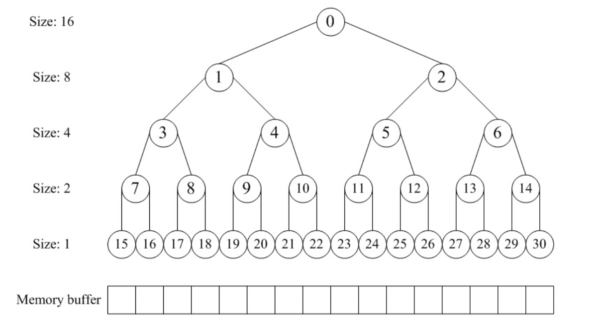
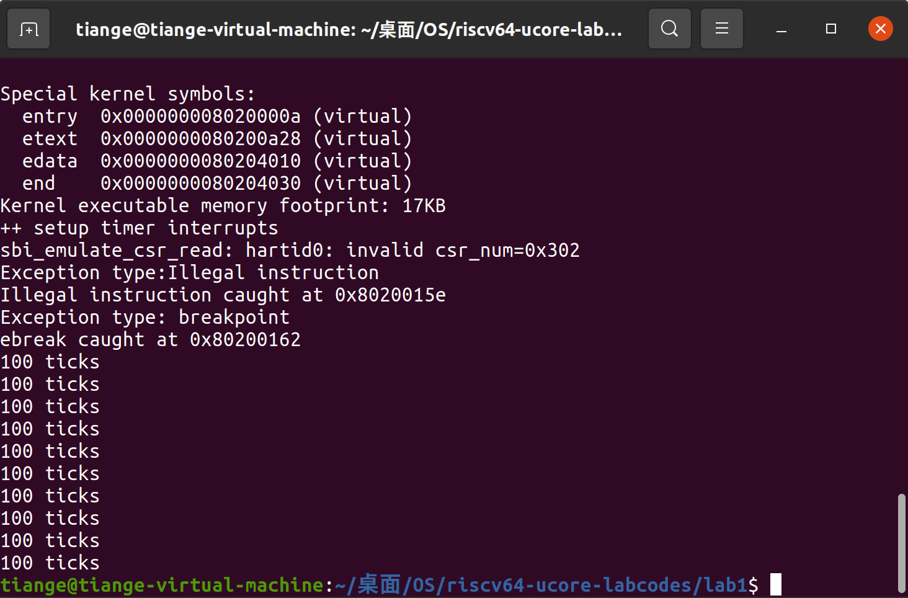
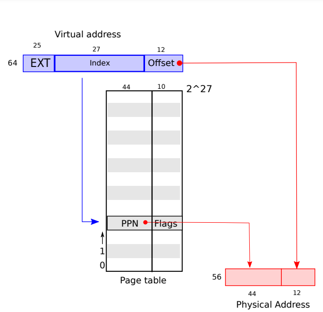
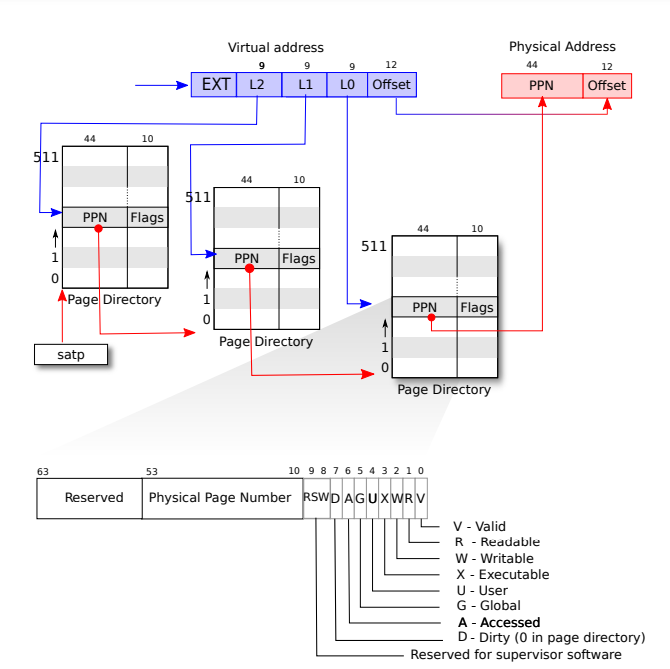

[TOC]

## 练习1：理解first-fit 连续物理内存分配算法（思考题）

>first-fit 连续物理内存分配算法作为物理内存分配一个很基础的方法，需要同学们理解它的实现过程。请大家仔细阅读实验手册的教程并结合`kern/mm/default_pmm.c`中的相关代码，认真分析default_init，default_init_memmap，default_alloc_pages， default_free_pages等相关函数，并描述程序在进行物理内存分配的过程以及各个函数的作用。 请在实验报告中简要说明你的设计实现过程。请回答如下问题：
>
>- 你的first fit算法是否有进一步的改进空间？

物理内存分配是操作系统管理内存的重要部分。在物理内存分配中，内核需要维护哪些页面是空闲的，哪些已经被分配出去。`default_init`、`default_init_memmap`、`default_alloc_pages`、`default_free_pages` 等函数共同构成了一个物理内存分配系统的核心机制，负责初始化内存管理结构，进行页面分配和释放。

### 物理内存分配的过程

1. **内存初始化 (`default_init`, `default_init_memmap`)**：
   - 系统启动时，操作系统需要初始化物理内存管理系统，以追踪哪些页面可以被分配，哪些页面已经分配出去。

2. **页面分配 (`default_alloc_pages`)**：
   - 当操作系统或用户程序请求内存时，内存管理系统会根据请求大小分配对应数量的页面。

3. **页面释放 (`default_free_pages`)**：
   - 当内存不再需要时，释放已经分配的页面，并将它们重新加入到空闲页面列表中，以便将来再次分配。

接下来逐个分析这些函数及其作用：

### 1. `default_init`

#### 功能：

`default_init` 函数是物理内存分配系统的初始化入口。它的作用是初始化内存管理的数据结构和空闲页面链表（`free_list`），为后续的内存管理工作做好准备。

#### 作用：

- 初始化内存管理系统，使得其他内存管理函数可以正常工作。
- 为物理内存管理设置一个初始状态。

```c
static void default_init(void) {
    // 初始化空闲页面链表
    list_init(&free_list);
    nr_free = 0;  // 初始化空闲页面数为 0
}
```

- `list_init(&free_list)`：初始化一个用于管理空闲页面块的链表。
- `nr_free = 0`：初始化表示当前空闲页面数量的计数器。

### 2. `default_init_memmap`

#### 功能：

`default_init_memmap` 函数用于初始化从某个基地址（`base`）开始的连续物理页面，并将这些页面标记为可供分配的空闲页面。

#### 作用：

- 将指定区域的页面初始化为可分配状态，并将它们插入到空闲页面列表中。
- 主要作用是在物理内存初始化时，将某些内存区域设置为可用（空闲）。

#### 实现过程：

```c
static void default_init_memmap(struct Page *base, size_t n) {
    assert(n > 0);
    
    // 对 base 开始的 n 个页面进行初始化
    struct Page *p = base;
    for (; p != base + n; p++) {
        assert(PageReserved(p) == 0);  // 确保页面未被保留
        p->flags = 0;  // 清除页面标志
        set_page_ref(p, 0);  // 将引用计数设为 0
    }
    
    base->property = n;  // 设置 base 页面的 property 为 n，表示该块的大小
    SetPageProperty(base);  // 设置页面属性
    nr_free += n;  // 增加空闲页面计数
    
     if (list_empty(&free_list)) {//如果空闲链表为空直接加入
        list_add(&free_list, &(base->page_link));
    } else {
        list_entry_t* le = &free_list;
         //调用 list_next(le) 都获取下一个链表节点，直到再次回到 free_list 链表头部。
        while ((le = list_next(le)) != &free_list) {
            struct Page* page = le2page(le, page_link);
            //如果 base 页面块的地址小于当前遍历到的页面块 page 的地址，base 在 page 之前插入。
            if (base < page) {
                list_add_before(le, &(base->page_link));
                break;
            } else if (list_next(le) == &free_list) {//如果遍历到了链表的最后一个元素，说明 base 的地址大于链表中的所有元素
                //因此调用 list_add 将 base 插入到链表的尾部。
                list_add(le, &(base->page_link));
            }
        }
    }
}
```

- 该函数将 `base` 开始的 `n` 个页面标记为可用，并将它们添加到空闲列表中。
- `base->property = n`：`property` 字段记录当前页面块的大小，用于合并和管理页面块。

### 3. `default_alloc_pages`

#### 功能：

`default_alloc_pages` 函数负责从空闲页面列表中分配 `n` 个连续页面，并返回分配的页面的基地址。

#### 作用：

- 在空闲页面列表中查找满足条件的连续页面块，进行内存分配。
- 更新空闲页面列表和空闲页面数。

#### 实现过程：

```c
static struct Page * 
default_alloc_pages(size_t n) {//分配 n 个连续的页面
    assert(n > 0);
    if (n > nr_free) {
        return NULL;
    }
    struct Page *page = NULL;
    list_entry_t *le = &free_list;
    while ((le = list_next(le)) != &free_list) {//遍历空闲页列表，找到第一个 property 值大于或等于 n 的页面
        struct Page *p = le2page(le, page_link);
        if (p->property >= n) {
            page = p;
            break;
        }
    }
    /*如果找到了足够大的空闲块，将其从空闲列表中删除，
    并根据实际分配大小调整剩余空闲块的 property，将剩余部分重新插入空闲列表。*/
    if (page != NULL) {
        list_entry_t* prev = list_prev(&(page->page_link));
        list_del(&(page->page_link));
        if (page->property > n) {
            struct Page *p = page + n;//p指向n页后的页面位置
            p->property = page->property - n;//把页面块的大小缩小n页
            SetPageProperty(p);
            list_add(prev, &(p->page_link));
        }
        nr_free -= n;//清除已分配页面的 PageProperty 标志位，并更新 nr_free 的值。
        ClearPageProperty(page);
    }
    return page;
}
```

- `default_alloc_pages` 从 `free_list` 中查找大小为 `n` 的连续页面块，并进行分配。
- 如果找到的页面块大于 `n`，则分割该块，将剩余部分重新插入到空闲列表中。
- 返回指向分配的页面块基地址的指针。

### 4. `default_free_pages`

#### 功能：

`default_free_pages` 函数负责将 `n` 个连续的页面重新释放并插入到空闲页面列表中。如果与前后页面块相邻，还会尝试合并相邻的空闲页面块。

#### 作用：

- 将分配的页面重新标记为空闲，并插入空闲列表。
- 通过合并相邻的页面块，避免内存碎片化。

#### 实现过程：

```c
void default_free_pages(struct Page *base, size_t n) {
    assert(n > 0);
    struct Page *p = base;
    
    // 重置每个页面的标志和引用计数
    for (; p != base + n; p++) {
        assert(!PageReserved(p) && !PageProperty(p));
        //断言该页面既不是保留页面（!PageReserved(p)），也没有页面属性（!PageProperty(p)）
        p->flags = 0;
        set_page_ref(p, 0);
    }
    
    base->property = n;
    SetPageProperty(base);
    nr_free += n;
    
    // 将页面块插入空闲列表
    if (list_empty(&free_list)) {
        list_add(&free_list, &(base->page_link));
    } else {
        list_entry_t* le = &free_list;
        while ((le = list_next(le)) != &free_list) {
            struct Page* page = le2page(le, page_link);
            if (base < page) {
                list_add_before(le, &(base->page_link));
                break;
            } else if (list_next(le) == &free_list) {
                list_add(le, &(base->page_link));
            }
        }
    }
    
    // 合并与前一个页面块
    list_entry_t* le = list_prev(&(base->page_link));
    if (le != &free_list) {
        p = le2page(le, page_link);
        if (p + p->property == base) {//检查 base 前面的页面块是否与它相邻
            p->property += base->property;//前页相邻判断条件
            //更新 property，同时从链表中删除 base，因为它已经被合并。
            ClearPageProperty(base);
            list_del(&(base->page_link));
            base = p;//base合并到前一个页面中
        }
    }
    
    // 合并与后一个页面块
    le = list_next(&(base->page_link));
    if (le != &free_list) {
        p = le2page(le, page_link);
        if (base + base->property == p) {//检查 base 后面的页面块是否与它相邻
        //如果相邻，继续合并两个页面块，更新 base->property 并从链表中删除相邻的块
            base->property += p->property;
            ClearPageProperty(p);
            list_del(&(p->page_link));//删除后面相邻的页面
        }
    }
}
```

- 该函数释放从 `base` 开始的 `n` 个页面，重置每个页面的标志和引用计数，并将它们重新插入空闲链表中。
- 检查并合并与前后相邻的空闲页面块，以减少碎片化。

### first-fit 算法优化

First Fit 算法在分配物理内存时效率相对较高，因为它会找到第一个满足大小要求的空闲块，然后直接进行分配。但是，**First Fit** 算法也有一些潜在的改进空间，尤其是在以下几个方面：

#### 1. 内存碎片化问题

- **问题**：First Fit 在寻找第一个足够大的空闲块时，可能会导致许多小的空闲块散落在内存中。这些碎片块可能无法满足后续较大内存请求，导致内存利用率下降。
- **改进建议**：可以通过定期合并相邻的空闲块来减少碎片化。这可以通过在释放内存时检查相邻块并进行合并（如 `default_free_pages` 函数中已经实现的合并逻辑），或者通过定期运行碎片整理程序来实现。

#### 2. 搜索效率

- **问题**：First Fit 算法从空闲块列表的头开始查找，可能导致在较大内存分配需求下，扫描了大量较小的空闲块，降低了查找效率，尤其是当内存分配请求频繁时。
- **改进建议**：可以通过维护多个空闲块链表，根据块大小分类空闲页面块。例如，将空闲页面块按大小分类为小、中、大几类（类似于 **Buddy System** 或 **Segregated Fit**），这样可以在分配时直接从合适大小的链表中查找，减少搜索时间。

#### 3. 减少大块分割

- **问题**：当找到的空闲块比请求的内存大时，First Fit 会将其分割为一个小块和剩余块。频繁的分割可能导致内存中出现许多小的空闲块，增加碎片化。
- **改进建议**：可以设置一定的阈值，当空闲块与请求内存的大小差异小于某个阈值时，直接分配整个块，而不再进行分割。这样虽然浪费了一些空间，但可以减少过多的小碎片的产生。

#### 4. 启发式优化

- **问题**：First Fit 是一种贪心算法，可能并不总是找到最优的块来进行分配。
- **改进建议**：可以引入启发式方法，例如 **Best Fit** 或 **Next Fit**。Best Fit 会查找最接近请求大小的空闲块，虽然它在分配时需要遍历更多块，但能更好地利用内存。Next Fit 则可以避免每次从头开始搜索空闲块，通过记录上次分配的位置，提高在连续分配请求下的效率。

#### 5.分页（Paging）机制的引入

- **改进建议**：结合分页机制，在物理上分配不连续的页面，但在逻辑上提供连续的地址空间。这样可以减少对大块连续内存的需求，从而避免由于碎片化导致的内存浪费。


## 练习2：实现 Best-Fit 连续物理内存分配算法（需要编程）

### 1、内存初始化

#### 功能：

初始化给定数量的物理内存页框（struct Page），清空它们的标志和属性，并将它们加入到空闲链表中。

#### 实现过程：

- 使用循环遍历每一个页框，将它们的标志（flags）和属性（property）重置为0，并将引用计数设置为0。
- 将第一个页框的属性设置为总页框数。
- 更新空闲页框的总数（nr_free）。
- 在空闲链表中插入新初始化的页框，保持链表的有序性。

### 2、页框分配

#### 功能：

根据请求的页框数量（n），从空闲链表中查找并分配合适的页框。

#### 实现过程：

- 确保请求的页框数大于0，并且不超过当前可用的页框数（nr_free）。
- 遍历空闲链表，寻找最小的满足请求的空闲页框。使用min_size变量跟踪找到的最小空闲页框数量。
- 一旦找到合适的页框，就从空闲链表中删除它，并在必要时分割它。
- 更新总的空闲页框数量并清除已分配页框的属性。

### 3、页框释放

#### 功能：

释放指定数量的页框，将它们标记为可用。

#### 实现过程：

- 清除每个页框的标志和引用计数，设置属性为释放的页框数，更新空闲页框数量（nr_free）。
- 将释放的页框插入空闲链表，保持链表的顺序。
- 检查是否可以合并相邻的空闲页框，以减少内存碎片。分别检查前后相邻页框是否连续，进行合并操作。

### 4、Best-Fit 算法的改进空间

尽管上述实现已经提供了一种有效的内存分配方式，但 Best-Fit 算法本身在某些情况下可能存在性能问题和内存碎片的问题。以下是一些可能的改进方向：

- 内存碎片：Best-Fit 可能会导致内存碎片化，因为它会留下一些非常小的空闲块，这些小块可能无法满足后续的分配请求。可以考虑在分配时合并较小的空闲块，或使用更复杂的合并策略。
- 查找效率：在当前实现中，每次分配时都需要遍历整个空闲链表以找到最佳匹配。这种查找可能是线性的，导致性能下降。可以考虑使用更高效的数据结构（如平衡树或散列表）来存储空闲块，从而加速查找过程。
- 动态合并策略：结合其他算法（如最坏适应或首次适应）实现动态合并策略，以减少内存分配时的碎片化。动态选择分配策略可以根据当前的内存状态选择最合适的算法。
- 使用位图管理内存：采用位图管理内存，以便更快速地跟踪空闲和已分配的页框。这种方式可以减少搜索空闲块所需的时间。
- 固定大小的块：考虑将内存分配限制在固定大小的块（如4KB），这样可以减少分配和释放过程中可能出现的复杂性。

## 扩展练习Challenge：buddy system（伙伴系统）分配算法（需要编程）

> Buddy System算法把系统中的可用存储空间划分为存储块(Block)来进行管理, 每个存储块的大小必须是2的n次幂(Pow(2, n)), 即1, 2, 4, 8, 16, 32, 64, 128...
>
> 参考[伙伴分配器的一个极简实现](http://coolshell.cn/articles/10427.html)， 在ucore中实现buddy system分配算法，要求有比较充分的测试用例说明实现的正确性，需要有设计文档。

### Buddy System 内存管理与辅助算法

#### 1. 数据结构设计
Buddy 分配器通过一个**完全二叉树**管理内存。每个节点对应一个内存块，节点的值标记该块的使用状态。高层节点表示较大的内存块，低层节点表示较小的块，依靠这些标记属性来实现内存的分配与回收。



**核心数据结构：**

```c
struct buddy2 {
  unsigned size;     // 整个二叉树表示的内存区域的大小
  unsigned longest[1];  // 节点表示内存块的大小或最长空闲块
};
```

这里，`longest` 记录的是以该节点为根节点的子树中**最大**的空闲内存块大小。

**存储二叉树的数组：**
```c
struct buddy2 root[80000];  // 完全二叉树的数组表示，数组长度依情况设置
```

#### 2. 完全二叉树性质

根据完全二叉树的性质，可以确定父节点与子节点之间的关系：

- **左子节点**：`LEFT_LEAF(index) = 2 * index + 1`
- **右子节点**：`RIGHT_LEAF(index) = 2 * index + 2`
- **父节点**：`PARENT(index) = (index + 1) / 2 - 1`

这些运算通过宏定义封装：
```c
#define LEFT_LEAF(index) ((index) * 2 + 1)
#define RIGHT_LEAF(index) ((index) * 2 + 2)
#define PARENT(index) (((index) + 1) / 2 - 1)
```

#### 3. 辅助算法实现

3.1 `fixsize` 函数

此函数用于将请求的大小调整为**大于或等于**该大小的**最小 2 的幂次方**。

```c
static unsigned fixsize(unsigned size) {
  size |= size >> 1;
  size |= size >> 2;
  size |= size >> 4;
  size |= size >> 8;
  size |= size >> 16;
  return size + 1;
}
```
通过不断的按位运算将所有低位的 1 填满，最终结果再加 1 得到大于或等于输入值的 2 的幂次方。

3.2 `buddy2_new` 初始化二叉树

该函数用于初始化整个内存块对应的二叉树。大小由 `size` 指定。

```c
void buddy2_new( int size ) {
    unsigned node_size; 
    int i;
    if (size < 1 || !IS_POWER_OF_2(size))
        return;

    root[0].size = size;
    node_size = size * 2;   // 总结点数是size*2

    // 初始化每个节点管理的空闲空间块数
    for (i = 0; i < 2 * size - 1; ++i) {
        if (IS_POWER_OF_2(i+1)) // 下一层
            node_size /= 2;
        root[i].longest = node_size;   
    }
    return;
}
```
通过检查每个节点是否是 2 的幂，来判断是否进入新层，并相应减少块大小。

3.3 `buddy2_alloc` 分配内存

`buddy2_alloc` 负责从二叉树中**搜索并分配**合适大小的内存块，并返回偏移量。

```c
    // 检查空指针
    if (self == NULL)
        return -1;

    // 检查最大的可用块是否小于请求的大小
    if (self[0].longest < size)  // 假设根节点在索引 0
        return -1;

    // 从根节点开始搜索合适的节点
    for (node_size = self->size; node_size > size; node_size /= 2) {
        unsigned left_index = LEFT_LEAF(index);
        unsigned right_index = RIGHT_LEAF(index);

        if (self[left_index].longest >= size) {
            if (self[right_index].longest >= size) {
                // 选择两个中内存块较小的
                index = (self[left_index].longest <= self[right_index].longest) ? left_index : right_index;
            } else {
                index = left_index;  // 只有左子节点适合
            }
        } else {
            index = right_index;  // 只有右子节点适合
        }
    }
```
- 首先从根节点开始，向下搜索，选择内存较小且能容纳请求大小的块。
- 通过 `longest` 属性判断左右子树的空闲状态。

找到合适块后，标记为已使用，并向上回溯更新父节点的状态。

```c
    // 标记找到的块为已使用
    self[index].longest = 0;

    // 计算分配块的偏移量
    offset = (index + 1) * node_size - self->size;  

    // 更新父节点的 longest 值
    while (index) {
        index = PARENT(index);
        self[index].longest = MAX(self[LEFT_LEAF(index)].longest, self[RIGHT_LEAF(index)].longest);
    }
```

3.4 `buddy2_free` 释放内存

当释放内存时，需从释放的块开始，**逐层合并**并更新二叉树中节点的空闲状态。

```c
static struct Page *
buddy_alloc_pages(size_t n) {
    assert(n > 0);
    if (n > nr_free) {
        return NULL;
    }
    if (n <= 0)// 把n调整到合适大小
        n = 1;
    else if (!IS_POWER_OF_2(n)) // 不为2的幂时，向上取
        n = fixsize(n);
    // 找到合适的空闲块
    unsigned long offset = buddy2_alloc(root, n);

    list_entry_t *le = &free_list;
    struct Page *base = le2page(list_next(le), page_link);
    struct Page *page = base+offset; // 找到空闲块的第一页
    cprintf("alloc page offset %ld\n",offset);

    nr_free -= n; // 总的空闲块数减少
    page->property = n; // 记录空闲块的大小

    return page;
}
```
此函数通过向上遍历二叉树，检查是否可以将相邻的两个子块合并，并更新父节点的 `longest` 值。

### buddy_pmm_manager实现

#### （1） buddy_init_memmap
该函数用于初始化内存管理系统，具体来说是初始化 `Pages` 结构体和 `buddy` 系统的树结构。通过这个函数，整个内存块（即 `base` 开始的 `n` 页）被标记为可用。

- **代码逻辑**：
  1. **页初始化**：
     - 遍历 `base` 开始的 `n` 页，每一页的 `flags` 和 `property` 字段置零，表示这些页处于未使用状态。同时，重置页的引用计数（使用 `set_page_ref` 函数）。
  2. **管理空闲块**：
     - 对空闲块进行管理：将 `base` 页插入 `free_list` 中合适的位置。
     - 如果 `free_list` 为空，将 `base` 插入。
     - 如果 `free_list` 已有元素，按照内存地址从小到大的顺序插入 `base`，确保后续查找分配块时能够高效定位。
  3. **初始化 `buddy` 树**：
     - 判断 `n` 是否是 2 的幂次方，若是则直接调用 `buddy2_new(n)` 初始化 `buddy` 系统。
     - 否则，调用 `buddy2_new(fixsize(n) >> 1)`，将 `n` 调整为最近的 2 的幂次方再初始化 `buddy` 树。
  4. **更新空闲页总数**：
     - 将新初始化的 `n` 页的数量加到全局变量 `nr_free` 中，更新系统总的空闲页数量。

```c
static void
buddy_init_memmap(struct Page *base, size_t n) {
    assert(n > 0);
    struct Page *p = base;
    for (; p != base + n; p ++) { // 初始化每一页
        assert(PageReserved(p));
        p->flags = p->property = 0;
        set_page_ref(p, 0);
    }
    base->property = 0; 
    nr_free += n; // 空闲块总数

    if (list_empty(&free_list)) { 
        list_add(&free_list, &(base->page_link));
    } 
    else { // freelist不为空，找到合适的位置插入
        list_entry_t* le = &free_list; // 从头开始遍历
        while ((le = list_next(le)) != &free_list) {
            struct Page* page = le2page(le, page_link); 
            if (base < page) {
                list_add_before(le, &(base->page_link));
                break;
            } else if (list_next(le) == &free_list) {
                list_add(le, &(base->page_link));
            }
        }
    }
    if(IS_POWER_OF_2(n)) { // 如果是2的幂次方，那么就可以用来初始化树
        buddy2_new(n);
    }
    else{ // 将大于 n 的最小 2 的幂次方减小为不超过 n 的最大 2 的幂次方
        buddy2_new(fixsize(n)>>1);
    }
    total_size=n;
}
```

#### （2） buddy_alloc_pages
该函数用于分配大小为 `n` 页的内存块。通过调用 `buddy2_alloc` 函数，该函数可以高效地从 `buddy` 系统中分配内存。

- **代码逻辑**：
  1. **调整请求页数**：
     - 如果 `n` 不是 2 的幂次方，则通过 `fixsize(n)` 调整为不小于 `n` 的最小的 2 的幂次方。
  2. **调用 `buddy2_alloc` 分配内存**：
     - 调用 `buddy2_alloc` 函数，从 `buddy` 树中找到最合适的空闲块，返回该块相对于 `Pages` 结构体 `base` 页的偏移量。
  3. **定位分配页**：
     - 通过返回的偏移量，定位到 `Pages` 数组中的具体页，即分配的页。
     - 将该页的 `property` 字段设为 `n`，表示该块大小为 `n` 页。
  4. **更新空闲页总数**：
     - 将分配的页数从全局变量 `nr_free` 中减去，更新系统中的空闲页数。
  5. **返回分配的页**：
     - 返回 `Pages` 数组中的对应页，作为分配内存的起始页。

```c
static struct Page *
buddy_alloc_pages(size_t n) {
    assert(n > 0);
    if (n > nr_free) {
        return NULL;
    }
    if (n <= 0)// 把n调整到合适大小
        n = 1;
    else if (!IS_POWER_OF_2(n)) // 不为2的幂时，向上取
        n = fixsize(n);
    // 找到合适的空闲块
    unsigned long offset = buddy2_alloc(root, n);

    list_entry_t *le = &free_list;
    struct Page *base = le2page(list_next(le), page_link);
    struct Page *page = base+offset; // 找到空闲块的第一页
    cprintf("alloc page offset %ld\n",offset);

    nr_free -= n; // 总的空闲块数减少
    page->property = n; // 记录空闲块的大小

    return page;
}
```

#### （3） buddy_free_pages
该函数用于释放指定大小的内存块，将内存块重新标记为可用。

- **代码逻辑**：
  1. **获取块大小**：
     - 从 `base->property` 字段中获取块的实际大小（`n` 页），该字段记录了该内存块分配时的页数。
  2. **计算偏移量**：
     - 计算当前 `base` 页相对于 `Pages` 数组起始页的偏移量，用于在 `buddy` 树中查找和更新。
  3. **调用 `buddy2_free` 释放内存**：
     - 调用 `buddy2_free` 函数，将该内存块在 `buddy` 树中标记为可用块，并且可能会合并相邻的空闲块。
  4. **更新每一页的状态**：
     - 遍历 `base` 开始的 `n` 页，将每一页的引用计数重置为 0，并将 `property` 字段设为 0，表示该块不再管理任何内存。
  5. **更新空闲页总数**：
     - 将释放的页数加到全局变量 `nr_free` 中，更新系统中的空闲页数。

```c
static void
buddy_free_pages(struct Page *base, size_t n) {
    assert(n>0);
    n = base->property; // 从property中拿到空闲块的大小

    struct buddy2* self=root;
    list_entry_t *le=&free_list;
    struct Page *base_page = le2page(list_next(le), page_link); 
    unsigned int offset= base - base_page; // 释放块的偏移量
    cprintf("free page offset %d\n),",offset);
    assert(self&&offset >= 0&&offset < self->size); // 是否合法
    
    struct Page *p = base;
    for (; p != base + n; p ++) { // 释放每一页
        assert(!PageReserved(p));
        set_page_ref(p, 0);
    }
    base->property = 0; // 当前页不再管辖任何空闲块
    nr_free += n;

    buddy2_free(self, offset); // 释放空闲块
}
```

#### （4） buddy_system测试：

1. **分配内存块：**
   - 分配了 `p0`、`p1`、`p2` 和 `p3` 四个不同大小的内存块，并通过 `assert()` 验证内存分配的地址是否符合 `buddy system` 的策略。
   - 对于 `p0`，分配了大小为 70 页的块；对于 `p1`，分配了 35 页；`p2` 分配了 257 页，`p3` 分配了 63 页。
2. **验证内存块的相对位置：**
   - 使用 `assert((p1 - p0) == 128)` 语句来验证 `p1` 和 `p0` 之间的地址差是否为 128 页，说明 `buddy system` 在分配时有一定的对齐约束。
   - `p2` 和 `p1` 之间的差值为 384 页，验证通过 `assert((p2 - p1) == 384)`。
   - `p3` 和 `p1` 的差值为 64 页。
3. **释放内存块：**
   - 释放 `p0`、`p1` 和 `p3`，使系统恢复部分内存，并通过控制台输出来确认释放过程是否正确。
4. **再次分配内存块：**
   - 申请 `p4` 和 `p5`，每个块的大小为 255 页。
   - 通过 `assert((p2 - p4) == 512)` 和 `assert((p5 - p4) == 256)` 验证新分配的块与之前释放的块的位置是否符合 `buddy system` 的合并和拆分策略。
5. **最终释放所有内存块：**
   - 在最后一步，释放 `p2`、`p4` 和 `p5`，确保内存完全回收。

```c
static void
buddy_check(void) {
    struct Page *p0, *p1,*p2;
    p0 = p1 = NULL;
    p2=NULL;
    struct Page *p3, *p4,*p5;
    assert((p0 = alloc_page()) != NULL);
    assert((p1 = alloc_page()) != NULL);
    assert((p2 = alloc_page()) != NULL);
    free_page(p0);
    free_page(p1);
    free_page(p2);
    
    p0=alloc_pages(70);
    p1=alloc_pages(35);
    //注意，一个结构体指针是20个字节，有3个int,3*4，还有一个双向链表,两个指针是8。加载一起是20。
    cprintf("p0 %p\n",p0);
    cprintf("p1 %p\n",p1);
    cprintf("p1-p0 equal %p ?=128\n",p1-p0);//应该差128
    
    p2=alloc_pages(257);
    cprintf("p2 %p\n",p2);
    cprintf("p2-p1 equal %p ?=128+256\n",p2-p1);//应该差384
    
    p3=alloc_pages(63);
    cprintf("p3 %p\n",p3);
    cprintf("p3-p1 equal %p ?=64\n",p3-p1);//应该差64
    
    free_pages(p0,70);    
    cprintf("free p0!\n");
    free_pages(p1,35);
    cprintf("free p1!\n");
    free_pages(p3,63);    
    cprintf("free p3!\n");
    
    p4=alloc_pages(255);
    cprintf("p4 %p\n",p4);
    cprintf("p2-p4 equal %p ?=512\n",p2-p4);//应该差512
    
    p5=alloc_pages(255);
    cprintf("p5 %p\n",p5);
    cprintf("p5-p4 equal %p ?=256\n",p5-p4);//应该差256
        free_pages(p2,257);    
    cprintf("free p2!\n");
        free_pages(p4,255);    
    cprintf("free p4!\n"); 
            free_pages(p5,255);    
    cprintf("free p5!\n");   
    cprintf("CHECK DONE!\n") ;
}
```



## 扩展练习Challenge：任意大小的内存单元slub分配算法（需要编程）

## 扩展练习Challenge：硬件的可用物理内存范围的获取方法（思考题）

获取硬件的可用物理内存范围对于操作系统（OS）是一个重要任务，尤其是在启动过程中。因为操作系统需要了解系统可用的内存资源，以便有效地管理内存、分配资源以及优化性能。以下是几种可能的方法来获取可用物理内存范围，即使操作系统在启动时无法提前知道这些信息：

### 1. BIOS/UEFI信息读取
在计算机启动时，BIOS或UEFI固件会初始化硬件并提供有关系统配置的信息。操作系统可以通过以下方式获取可用内存范围：

- **BIOS中断调用**：在传统的BIOS系统中，可以通过调用特定的BIOS中断（如`INT 0x15`）来查询内存映射信息。
- **UEFI接口**：在UEFI系统中，操作系统可以使用EFI Boot Services中的`GetMemoryMap`函数，获取系统内存的映射，包括可用和保留的内存区域。

### 2. 内存映射 I/O（MMIO）
通过直接访问系统内存和硬件寄存器，操作系统可以获取系统内存的布局。以下是相关步骤：

- **查询内存控制器**：在现代系统中，内存控制器（如北桥芯片）通常会提供内存映射信息。通过与内存控制器通信，操作系统可以获取可用内存的信息。
- **读取内存区域**：直接读取特定地址（如`0x00000000`到`0xFFFFFFFF`范围内）以识别可用的内存区域。这通常涉及在启动阶段对内存进行探测。

### 3. 设备树（Device Tree）
在一些嵌入式系统或特定架构（如ARM架构）中，设备树是描述硬件组件的一种数据结构。操作系统可以解析设备树，获取内存信息。

- **解析设备树**：设备树中通常包含内存节点，操作系统可以通过解析这些节点来获取可用物理内存的范围。

### 4. 内存检测算法
在启动时，操作系统可以使用内存检测算法来识别可用内存：

- **内存检测**：操作系统可以通过尝试访问某一内存区域并检测是否会产生错误来识别内存的可用性。这种方法通常涉及遍历一定范围的内存地址，以识别哪些区域是可用的。

### 5. 系统管理模式（SMM）
在某些系统中，SMM可用于在系统运行时执行代码并访问硬件资源。操作系统可以通过SMM获取内存范围信息。

### 6. ACPI（高级配置和电源接口）
操作系统还可以通过ACPI表获取内存配置。ACPI表提供了系统的硬件配置和管理信息，包括可用内存范围。

- **解析ACPI表**：通过读取ACPI中的`Memory Mapped`相关表（如MADT、SRAT），操作系统可以获取内存的分布情况。

### 7. 驱动程序与内核模块
在某些情况下，操作系统的驱动程序和内核模块可以在系统运行时访问特定硬件资源，以获取更多的内存信息。


## **OS相关知识点**

### 三级页表和地址转换

1. **页表的基本概念**

   - **页表** 是操作系统用来将虚拟地址（Virtual Address, VA）映射到物理地址（Physical Address, PA）的数据结构，帮助操作系统实现虚拟内存机制。
   - 页表存储了虚拟地址和物理内存之间的映射关系，确保每个进程能够拥有独立的虚拟地址空间，从而提高内存利用率，并保证内存隔离。

2. **虚拟地址的划分**

   - 在64位系统中，虚拟地址通常被划分为几部分：
     - 高位保留位：未使用或硬件保留部分。
     - **页码**（Page Number）：用于索引页表，决定虚拟地址对应的物理页面。
     - **偏移量**（Offset）：页内偏移，用于定位具体的内存地址。

   - 例如，在系统中，虚拟地址的低12位通常作为页内偏移量，表示4KB的页面大小。

3. **页表条目（PTE, Page Table Entry）**

   - 页表中的每一项都是一个**页表条目**，它保存了虚拟地址对应的物理地址的部分信息。
   - 典型页表条目的内容：
     - **PPN**（Physical Page Number）：物理页面号，指向物理内存中的某个页面。
     - **V**（Valid）：页表条目是否有效。
     - **U**（User）：是否允许用户态访问。
     - **W**（Writable）：是否允许写操作。
     - **RSV**：保留位，通常被MMU（内存管理单元）忽略。

4. **页表的工作原理**

   - 在程序执行时，CPU通过**MMU**将虚拟地址转换为物理地址。这个过程是通过访问页表完成的：
     1. 虚拟地址中的页码被用于索引页表，找到对应的物理地址。
     2. 页表条目中的**PPN**确定物理地址的高位部分，而虚拟地址的偏移量提供了页面内的具体地址。
     3. 最终的物理地址由页表的PPN和虚拟地址的Offset组成。



**5. 三级页表的引入**

   - **三级页表** 是为了解决单级页表的空间浪费问题，将页码分成三部分，逐级缩小查找范围，从而减少不必要的内存占用。
   - 三级页表的工作流程：
     1. 使用虚拟地址的前9位查找第一级页表，找到第二级页表的地址。
     2. 使用虚拟地址的中间9位查找第二级页表，找到第三级页表的地址。
     3. 使用虚拟地址的最后9位查找第三级页表，找到物理地址的高位部分。
     4. 最终物理地址由第三级页表提供的物理页面号和虚拟地址的页内偏移量共同构成。
   - 三级页表通过分层查找，避免了为每个进程分配庞大的页表，极大地减少了内存占用。



### Freelist 的构造与管理

Freelist 通常以链表的形式实现，其每个节点记录一个可用的内存块。在本次实验中，Freelist 的每个节点是一个 `list_entry` 结构，通过这个结构可以索引到与之关联的 `struct page`。具体来说：
- 每个 `page` 结构体代表一个物理页块，其中关键属性 `page->property` 记录了这个内存块的大小。
- 通过将 `list_entry` 组成链表，系统可以高效地遍历和分配内存块。

#### Freelist 构造示例
```c
struct page {
    list_entry_t list;  // 链表节点
    unsigned int property;  // 表示当前页块的大小
};

list_entry_t freelist;  // freelist 链表头
```

Freelist 的作用是通过记录和管理内存块，来方便内存分配器找到足够大小的空闲内存块。此外，Freelist 也为内存碎片管理提供了基础。由于内存的分配和释放可能导致内存碎片，操作系统使用 Freelist 进行内存合并和回收，从而减少外部碎片（内存块之间的未分配空间）和内部碎片（内存块中未使用的部分）。

### 页表的构造
在虚拟内存管理中，页表是用来映射虚拟地址（VA）到物理地址（PA）的数据结构。页表通过多级结构来减少内存的浪费并高效管理虚拟地址空间。实验中汇编代码如下：

```assembly
kern_entry:
    # t0 := 三级页表的虚拟地址
    lui     t0, %hi(boot_page_table_sv39)
    # t1 := 0xffffffff40000000 即虚实映射偏移量
    li      t1, 0xffffffffc0000000 - 0x80000000
    # t0 减去虚实映射偏移量 0xffffffff40000000，变为三级页表的物理地址
    sub     t0, t0, t1
    # t0 >>= 12，变为三级页表的物理页号
    srli    t0, t0, 12

    # t1 := 8 << 60，设置 satp 的 MODE 字段为 Sv39
    li      t1, 8 << 60
    # 将刚才计算出的预设三级页表物理页号附加到 satp 中
    or      t0, t0, t1
    # 将算出的 t0(即新的MODE|页表基址物理页号) 覆盖到 satp 中
    csrw    satp, t0
    # 使用 sfence.vma 指令刷新 TLB
    sfence.vma
    # 从此，我们给内核搭建出了一个完美的虚拟内存空间！
```

#### 构造页表的步骤
1. **初始化页表：** 使用 Freelist 分配一个新的页表。
   
   - 系统首先在 Freelist 中找到可用的内存块，用来存放页表。
   - 通过映射虚拟地址的索引值，将物理页号写入页表条目中。
   
2. **设置 `satp` 寄存器：** `satp` 是 RISC-V 中的页表基址寄存器，它记录了当前页表的起始地址。在页表构建完成后，将其地址写入 `satp` 寄存器。
   
   ```c
   uintptr_t page_table_addr = get_page_table();  // 获取页表的物理地址
   set_satp(page_table_addr);  // 设置 satp
   ```
   
3. **刷新 TLB：** 当页表内容发生变化时，CPU 中的 TLB（Translation Lookaside Buffer）可能仍然保留旧的地址映射。为了确保内存地址转换的正确性，需要通过 `sfence.vma` 指令来刷新 TLB。
   
   ```asm
   sfence.vma
   ```

### `Page` 结构体和页面状态标志

`struct Page` 结构体用于描述物理内存中的页帧（page frame），是内存管理系统中一个重要的数据结构。每一个 `Page` 实例表示一个物理页帧的信息，包含页帧的引用计数、状态标志、空闲块的大小等。下面是对每个字段的解释：

```c
struct Page {
    int ref;                        // 页帧的引用计数，用于跟踪该页帧被引用的次数。
    uint64_t flags;                 // 页帧状态的标志位，描述该页帧的当前状态（例如是否在使用，是否为保留页等）。
    unsigned int property;          // 描述空闲块的大小，用于内存分配算法（例如首次适配算法），表示当前页面块的大小。
    list_entry_t page_link;         // 链表节点，用于将页帧挂入空闲页链表（free list），用于管理空闲页帧。
};
```

#### 字段解释

1. **`ref` (引用计数器)**: 
   - 该字段用于记录当前页帧被多少个进程或数据结构引用。每当有进程映射或使用该页时，`ref` 会递增，当不再使用时，`ref` 会递减。如果 `ref == 0`，则说明该页帧不再被使用，可以被回收或放入空闲列表。

2. **`flags` (状态标志)**: 
   - 该字段是页帧的状态标志位，通过 `flags` 可以记录和控制页帧的各种状态。例如，页面是否被使用、是否属于保留页（reserved）、是否处于缓存等。这个字段通常使用位操作（bitwise operations）来管理多种标志位。

3. **`property` (空闲块大小)**: 
   - 该字段通常在物理内存管理中用于表示连续的空闲页块大小。比如，当一个连续的页面块是空闲的，那么 `property` 可以指示从该页开始的空闲页的数量。在内存分配算法中，尤其是首次适配（first fit）或最佳适配（best fit）算法中，用这个字段来查找合适的空闲块进行分配。

4. **`page_link` (链表节点)**: 
   - 这是一个双向链表节点，通常与内存管理中的空闲页链表（free list）配合使用。它可以将空闲页帧链在一起，方便操作系统在分配或释放页面时进行管理。例如，在释放页面时，操作系统会将这些页帧重新挂入空闲页链表，等待下一次分配。

#### 页面状态标志

以下宏定义了页面状态标志的含义和操作：

```c
#define PG_reserved                 0       
#define PG_property                 1      
```

- **`PG_reserved`**：标志位，表示该页面是否被保留。如果该位为 1，说明该页面是内核保留的，不能用于分配或释放；如果为 0，则可以使用。

- **`PG_property`**：标志位，表示该页面是否为一个空闲内存块的头页。如果该位为 1，表示该页面是一个连续空闲内存块的头页，可以被分配；如果为 0，则该页面要么不是空闲内存块的头页，要么该页面及其内存块已经被分配。

### 函数指针的知识点总结

（1）函数指针的基本概念

   - **函数指针** 是指向函数的指针变量，用于存储函数的地址。通过函数指针，可以调用存储在其中的函数。
   - 函数指针的声明格式与普通指针类似，只是在变量名处使用括号和星号以表示这是一个指向函数的指针。

（2）函数指针的声明语法

   ```c
   返回值类型 (*函数指针名)(参数类型列表);
   ```
   - 示例：
     ```c
     void (*init)(void);  // 声明一个指针 init，指向返回值为 void、无参数的函数
     ```

（3）函数指针的使用

   - **赋值**：函数指针可以赋值为特定函数的地址，函数名本身就是函数的入口地址。
     
     ```c
     void init_func(void) { /*...*/ }
     init = init_func;  // 将 init_func 的地址赋值给函数指针 init
     ```
   - **调用**：使用函数指针时，通过 `(*函数指针)(参数列表)` 调用对应的函数。
     
     ```c
     (*init)();  // 调用函数指针 init 指向的函数
     ```

（4）结构体中的函数指针

   - 函数指针可以作为结构体的成员，允许在运行时动态指定或修改函数的实现。
   - 如 `pmm_manager` 结构体中，每个函数指针成员都指向不同的内存管理操作函数。

   ```c
   struct pmm_manager {
       const char *name;
       void (*init)(void);
       void (*init_memmap)(struct Page *base, size_t n);
       struct Page *(*alloc_pages)(size_t n);
       void (*free_pages)(struct Page *base, size_t n);
       size_t (*nr_free_pages)(void);
       void (*check)(void);
   };
   ```

（5）函数指针的用途

   - **灵活性**：函数指针可以动态指向不同的函数实现，尤其在需要动态选择不同的策略或算法时非常有用。
     - 例如，在内存管理系统中，可以根据不同的分配策略（如 First Fit、Best Fit）实现不同的 `alloc_pages` 函数，通过函数指针灵活切换。
   - **回调机制**：在某些库或框架中，函数指针常用于实现回调函数，让用户自定义一些行为。
   - **模块化设计**：函数指针常用于模块化编程，让系统的不同部分根据需要动态地调用不同模块的功能。

（6）函数指针的实例化

   在 `pmm_manager` 中，每个函数指针对应不同的物理内存管理操作。在不同的内存管理策略下，可以实例化多个 `pmm_manager`，为其函数指针绑定不同的实现函数。
   ```c
   struct pmm_manager my_pmm_manager = {
       .name = "First Fit",
       .init = first_fit_init,
       .init_memmap = first_fit_init_memmap,
       .alloc_pages = first_fit_alloc_pages,
       .free_pages = first_fit_free_pages,
       .nr_free_pages = first_fit_nr_free_pages,
       .check = first_fit_check,
   };
   ```

（7）函数指针数组

   函数指针也可以用作数组元素，适合需要选择不同操作的场景。例如，可以用函数指针数组来实现调度多种不同的分配策略：
   ```c
   void (*allocators[])(void) = {first_fit_alloc, best_fit_alloc, worst_fit_alloc};
   ```
