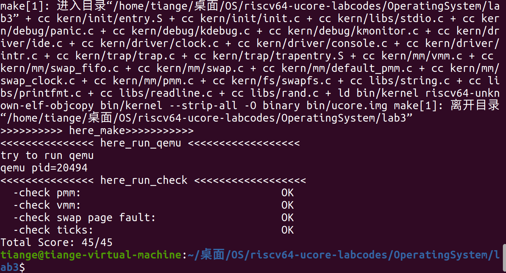
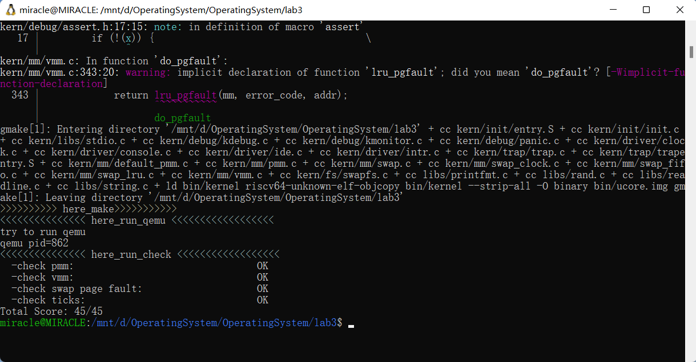
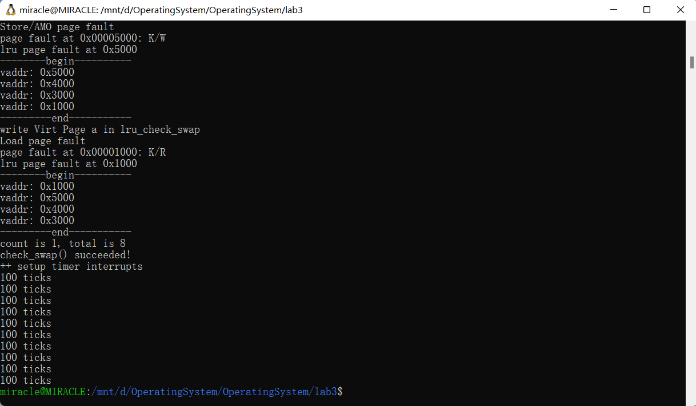

# lab 3 缺页异常和页面置换

#### 小组成员：徐亚民，肖胜杰，张天歌

- [lab 3 缺页异常和页面置换](#lab-3-缺页异常和页面置换)
      - [小组成员：徐亚民，肖胜杰，张天歌](#小组成员徐亚民肖胜杰张天歌)
  - [练习0：填写已有实验](#练习0填写已有实验)
  - [练习1：理解基于FIFO的页面替换算法（思考题）](#练习1理解基于fifo的页面替换算法思考题)
    - [1.1 流程梳理](#11-流程梳理)
    - [1.2 函数功能描述](#12-函数功能描述)
  - [练习2：深入理解不同分页模式的工作原理（思考题）](#练习2深入理解不同分页模式的工作原理思考题)
  - [练习3：给未被映射的地址映射上物理页（需要编程）](#练习3给未被映射的地址映射上物理页需要编程)
  - [练习4：补充完成Clock页替换算法（需要编程）](#练习4补充完成clock页替换算法需要编程)
    - [4.1 Clock页替换算法设计实现](#41-clock页替换算法设计实现)
    - [4.2 CLOCK 与 FIFO 算法的比较](#42-clock-与-fifo-算法的比较)
  - [练习5：阅读代码和实现手册，理解页表映射方式相关知识（思考题）](#练习5阅读代码和实现手册理解页表映射方式相关知识思考题)
    - [5.1 "一个大页"映射方式的优点](#51-一个大页映射方式的优点)
    - [5.2 "一个大页"映射方式的缺点](#52-一个大页映射方式的缺点)
    - [5.3 "分级页表"（多级页表）映射方式的优点](#53-分级页表多级页表映射方式的优点)
    - [5.4 "分级页表"（多级页表）映射方式的缺点](#54-分级页表多级页表映射方式的缺点)
    - [5.5 总结](#55-总结)
  - [扩展练习 Challenge：实现LRU页替换算法（需要编程）](#扩展练习-challenge实现lru页替换算法需要编程)
    - [设计思路](#设计思路)
    - [代码实现](#代码实现)
    - [测试函数](#测试函数)
    - [测试结果](#测试结果)
  - [知识点补充](#知识点补充)
    - [1. 分段管理 (Segmentation)](#1-分段管理-segmentation)
    - [2. 内存保护与隔离](#2-内存保护与隔离)
    - [3. 内存映射文件 (Memory-Mapped Files)](#3-内存映射文件-memory-mapped-files)
    - [4. 内存回收与垃圾回收 (Memory Reclamation / Garbage Collection)](#4-内存回收与垃圾回收-memory-reclamation--garbage-collection)
    - [5. 多级页表与更高级的分页机制](#5-多级页表与更高级的分页机制)
    - [6. 交换空间（Swap Space）与虚拟内存管理](#6-交换空间swap-space与虚拟内存管理)

## 练习0：填写已有实验

本实验依赖实验1/2。请把你做的实验1/2的代码填入本实验中代码中有“LAB1”,“LAB2”的注释相应部分。

## 练习1：理解基于FIFO的页面替换算法（思考题）

> 描述FIFO页面置换算法下，一个页面从被换入到被换出的过程中，会经过代码里哪些函数/宏的处理（或者说，需要调用哪些函数/宏），并用简单的一两句话描述每个函数在过程中做了什么？
>
> - 至少正确指出10个不同的函数分别做了什么？如果少于10个将酌情给分。我们认为只要函数原型不同，就算两个不同的函数。要求指出对执行过程有实际影响,删去后会导致输出结果不同的函数（例如assert）而不是`cprintf`这样的函数。

### 1.1 流程梳理

**首先梳理一下整体的工作流程，从初始化到页面置换，再到异常处理，逐步调用相关函数和宏以实现页面替换：**

**1. 初始化阶段**

- 操作系统启动时，`kern_init()`函数负责初始化内存管理、虚拟内存管理等。这里调用了 `swap_init()`，来初始化页面置换算法。
- `swap_init()` 调用了 `swapfs_init()` 检查页面交换文件系统，随后将 `swap_manager` 指向具体的页面置换算法实现（例如 FIFO）。若初始化成功，进入 `check_swap()` 验证交换功能。

**2. 异常处理阶段**

- 系统在运行时如果遇到页面访问异常，会通过 `exception_handler()` 进入 `pgfault_handler()` 处理页面错误。
- 在 `pgfault_handler()` 中，先调用 `print_pgfault()` 输出异常原因，然后进入 `do_pgfault()` 进行页面置换处理。

**3. 页面置换的核心过程（`do_pgfault()`）**

- **换入页面**：
  - 在 `do_pgfault()` 函数中，首先为待换入的页面做准备，获取页面对应的虚拟地址（通过 `find_vma()`）和页表项指针（通过 `get_pte()`）。
  - 调用 `swap_in()` 开始换入操作，先用 `alloc_page()` 分配一个新页面，然后判断是否需要换出其他页面以腾出空间。
  - 如果要将页面从磁盘换入内存，会通过 `swapfs_read()` 将数据写入内存。
  - 接着，通过 `page_insert()` 将新的页面插入页表，这里调用了 `page_ref_inc()`、`page_ref_dec()` 等函数来调整页面引用计数，并利用 `tlb_invalidate()` 刷新 TLB（即清除缓存的虚拟-物理地址映射），以确保新页面生效。
  - 最后，`swap_map_swappable()` 使页面可交换。通过链表结构维护页面队列，配合 `swap_out_victim()` 实现先进先出（FIFO）页面置换策略。
- **换出页面**：
  - 如果在 `alloc_page()` 时判定内存不足，需要腾出空间，则调用 `swap_out()` 进行换出操作。
  - 在 `swap_out()` 中，通过 `swap_out_victim()` 找到待换出的页面，并获取其虚拟地址对应的页表项。
  - 调用 `swapfs_write()` 将页面内容写到磁盘。若成功，则调用 `free_page()` 释放页面；若失败，调用 `swap_map_swappable()` 恢复页面状态。

### 1.2 函数功能描述

==接下来，对关键的 11 个函数进行功能描述：==

**1.1 `swap_init()`**

`swap_init()` 函数的作用是初始化页面替换算法。它首先调用 `swapfs_init()` 函数，以设置模拟硬盘的最大页偏移数并进行检查。接着，设置 `swap_manager` 指针，指定 FIFO 为页面替换算法。初始化成功后，会调用 `check_swap()` 检查页面交换功能。

**1.2 `exception_handler()` 与 `pgfault_handler()`**

`exception_handler()` 是异常处理的入口点，负责处理页面异常（如读取和存储页面缺页）。当缺页异常发生时，它会调用 `pgfault_handler()`，而 `pgfault_handler()` 再调用 `do_pgfault()` 处理缺页，将地址与内存建立映射。

**1.3 `do_pgfault()`**

`do_pgfault()` 是页面替换的核心，它首先通过 `find_vma()` 查找虚拟内存管理结构体中的虚拟地址区域，再通过 `get_pte()` 获取或创建页表项。接着调用 `swap_in()` 将需要的页换入内存，并通过 `page_insert()` 完成物理页和虚拟页的映射，最后标记该页为可交换。

**1.4 `swap_in()`**

`swap_in()` 将页面从硬盘加载到内存。它首先为缺页的虚拟地址分配物理页，接着使用 `get_pte()` 获取页表项，再调用 `swapfs_read()` 将数据从“硬盘”加载到内存中。

**1.5 `swapfs_read()` 与 `swapfs_write()`**

这两个函数负责对硬盘的读写，分别在页面换入和换出时调用。`ide_read_secs()` 和 `ide_write_secs()` 使用 `memcpy()` 模拟硬盘到内存的数据拷贝。

**1.6 `alloc_pages()`**

`alloc_pages()` 函数负责分配空闲的物理页，若页面已满，则通过 `swap_out()` 换出页。这个函数也是 `kmalloc()` 的底层支撑。

**1.7 `page_insert()`**

`page_insert()` 建立物理页和页表项的映射，同时管理页面引用计数 `ref`。映射后，它调用 `tlb_invalidate()` 刷新 TLB，以确保新映射的生效。

**1.8 `get_pte()`**

`get_pte()` 函数用于构建虚拟地址与页表项之间的映射，确保虚拟地址对应的页表项存在（若不存在，则创建一个新的）。其工作流程为：

1. 获取一级页目录项指针 `pdep1`，并检查其有效性 (`PTE_V` 位)。
2. 如果无效且需要创建，则分配新页并更新目录项。
3. 获取二级页目录项指针 `pdep0`，同样检查其有效性。
4. 如果无效且需要创建，则分配新页并更新。
5. 最后，返回虚拟地址对应的页表项指针。

**1.9 `swap_map_swappable()`**

该函数负责将页设置为可交换状态。在 `FIFO` 算法中，通过 `Page` 结构体中的 `pra_page_link` 成员来管理一个链表，以此实现先进先出的页替换机制：

1. 使用 `list_add` 函数将新的页面加入链表头部。
2. 后续换出操作可以基于该链表进行 FIFO 策略的页面替换。

**1.10 `swap_out()`**

`swap_out()` 是内存换出到硬盘的顶层接口，其执行流程为：

1. 使用 `swap_out_victim` 选择需要换出的页。
2. 检查页表项权限是否有效。
3. 使用 `swapfs_write` 进行页数据的写入。如果写入成功，则释放该页并更新页表项。
4. 调用 `tlb_invalidate` 以使 TLB 缓存失效。
5. 该函数可以处理多页换出，但当前实现仅能处理单页换出。

**1.11 `swap_out_victim()`**

`swap_out_victim()` 函数负责选择要换出的页面。对于 `FIFO` 策略，其实现逻辑为：

1. 通过链表尾部节点找到需要换出的页面。
2. 将该节点的页面存入 `ptr_page` 指向的地址。
3. 删除该链表节点，完成页的选择。


## 练习2：深入理解不同分页模式的工作原理（思考题）

### 2.1 `get_pte()`函数中的类似代码
在 RISC-V 架构中，虚拟内存的管理通过不同的页表结构实现。根据虚拟地址位数的不同，RISC-V 设计了多个虚拟地址模式，例如 sv32, sv39, 和 sv48，它们的主要区别在于虚拟地址的位数和页表的层级结构。以下是对这三种虚拟地址模式的详细分析，并对它们的异同进行梳理和补充。

- **sv32 (32-bit Virtual Address for RV32)**：
  - 架构类型：适用于 RISC-V 的 32 位架构（RV32）。
  - 虚拟地址位数：32 位虚拟地址空间。
  - 页表层级：使用 两级页表。
  - 虚拟地址划分：高 10 位用于索引二级页表（PTE），中间 10 位用于索引一级页表，低 12 位为页内偏移。
  - 页大小：12 位页内偏移意味着每页大小为 4KB（2^12 = 4096 bytes）。
  - 页表结构：第一级页表（一级页表基地址存储在物理内存中的某个位置），第二级页表指向实际的物理页地址（最后一级的物理地址）。

由于 RISC-V 32 位架构的虚拟地址空间是 32 位，因此只能支持最多 4 GB 的虚拟内存空间。为了实现这种映射，采用了两级页表机制。

- **sv39 (39-bit Virtual Address for RV64)**：
  - 架构类型：适用于 RISC-V 的 64 位架构（RV64）。
  - 虚拟地址位数：39 位虚拟地址空间。
  - 页表层级：使用 三级页表。
  - 虚拟地址划分：高 9 位用于索引三级页表（PTE），中间的两组 9 位分别用于索引中级和低级页表，低 12 位为页内偏移。
  - 页大小：与 sv32 相同，仍然是 4KB（12 位页内偏移）。
  - 页表结构：第一级页表（最顶层）指向第二级页表，第二级页表指向第三级页表，第三级页表包含实际物理页的地址。

sv39 架构允许最多 512 GB 的虚拟内存空间，因为它提供了 39 位的虚拟地址空间。三级页表的设计确保了可以有效地管理更大的地址空间。

- **sv48 (48-bit Virtual Address for RV64)**：
  - 架构类型：同样适用于 RISC-V 的 64 位架构（RV64）。
  - 虚拟地址位数：48 位虚拟地址空间。
  - 页表层级：使用 四级页表。
  - 虚拟地址划分：高 9 位用于索引四级页表（PTE），中间三组 9 位分别用于索引不同级别的页表，低 12 位为页内偏移。
  - 页大小：与前两种架构相同，仍然是 4KB（12 位页内偏移）。
  - 页表结构：第一级页表指向第二级页表，第二级页表指向第三级页表，第三级页表指向第四级页表，第四级页表包含最终的物理页地址。

sv48 架构通过提供 48 位的虚拟地址空间，支持最多 256 TB 的虚拟内存空间。四级页表机制能够更细粒度地管理更大规模的地址空间。

- **sv32, sv39, sv48 的异同分析**：

1、共同点：

①页表项结构：所有三种模式的页表项（Page Table Entry，PTE）都包含了物理页的地址，且通常包括标志位（如有效位、权限位等）。每一级页表的条目指向下一层页表或最终的物理页。
②页内偏移：在所有模式中，页内偏移都是 12 位，因此每个页的大小都是 4KB。
③地址映射机制：它们都采用多级页表机制（sv32 为两级，sv39 为三级，sv48 为四级），通过逐层分页映射虚拟地址到物理地址空间。

2、不同点：
①虚拟地址位数：
sv32 只有 32 位虚拟地址，支持的虚拟内存最大为 4GB。
sv39 提供了 39 位虚拟地址，支持最多 512 GB 的虚拟内存。
sv48 提供了 48 位虚拟地址，支持最多 256 TB 的虚拟内存。
②页表层级数：
sv32 使用两级页表：一级页表和二级页表。
sv39 使用三级页表：第一级到第三级页表。
sv48 使用四级页表：一级到四级页表。
③映射能力与性能：
随着虚拟地址空间的增大，页表层级数的增加导致了更复杂的地址翻译过程，但也提供了对更大内存空间的管理能力。
页表的深度增加会对地址转换的效率产生一定影响，需要更多的内存访问来完成每次虚拟地址到物理地址的转换。因此，增加页表级别（如 sv39 和 sv48 相较于 sv32）虽然能够支持更大的地址空间，但也带来了性能上的开销。


这两部分的内容相像的原因就是因为他们在做一样的事情，只是所在的页表层级不一样罢了。处于当前页表级别我们发现页表项内都是0，说明这里还没有对应的页表项，所以我们需要分配一个页，并且把页面全部清0，用于本层页表向下一级映射，并且在本级建立页表项，填入分配的物理页的页号。从而实现建立页表项映射下一级的事情，此时下一级并没有什么内容，只是分配了而已。

- **分析代码的相似**：

我们先来看这段相似的代码：

```c
pde_t *pdep1 = &pgdir[PDX1(la)];
    if (!(*pdep1 & PTE_V)) {
        struct Page *page;
        if (!create || (page = alloc_page()) == NULL) {
            return NULL;
        }
        set_page_ref(page, 1);
        uintptr_t pa = page2pa(page);
        memset(KADDR(pa), 0, PGSIZE);
        *pdep1 = pte_create(page2ppn(page), PTE_U | PTE_V);
    }
    pde_t *pdep0 = &((pde_t *)KADDR(PDE_ADDR(*pdep1)))[PDX0(la)];
//    pde_t *pdep0 = &((pde_t *)(PDE_ADDR(*pdep1)))[PDX0(la)];
    if (!(*pdep0 & PTE_V)) {
    	struct Page *page;
    	if (!create || (page = alloc_page()) == NULL) {
    		return NULL;
    	}
    	set_page_ref(page, 1);
    	uintptr_t pa = page2pa(page);
    	memset(KADDR(pa), 0, PGSIZE);
 //   	memset(pa, 0, PGSIZE);
    	*pdep0 = pte_create(page2ppn(page), PTE_U | PTE_V);
    }
```
这两部分的内容相像的原因就是因为他们在做一样的事情，只是所在的页表层级不一样罢了。处于当前页表级别我们发现页表项内都是0，说明这里还没有对应的页表项，所以我们需要分配一个页，并且把页面全部清0，用于本层页表向下一级映射，并且在本级建立页表项，填入分配的物理页的页号。从而实现建立页表项映射下一级的事情，此时下一级并没有什么内容，只是分配了而已。

### 2.2 get_pte()函数将页表项的查找和页表项的分配合并在一个函数的分析

我认为是好的

在设计虚拟内存的页表管理时，将查找和分配操作合并为一个单一的流程，能够显著提高系统的效率。通过利用标志位优化，查找操作不仅能完成页表项的查找功能，还可以在查找失败时直接进行分配操作，从而避免了传统方式中的两步操作。这种方法通过减少不必要的操作和提升执行效率，对高频率的内存访问场景尤其有益，有助于优化系统的整体性能。

具体来说，在设计页表管理的过程中，我们通常希望减少不必要的操作，尤其是在频繁的页表访问场景下。传统的做法是将查找与分配操作分开：首先执行查找，如果查找失败，则进行分配。然而，从实现的角度来看，查找本身就包含了分配的潜在需求。在查找过程中，操作系统可以通过检查页表项的有效性标记（例如一个“存在”标志位），来直接判断该页表项是否已被分配。如果未分配，可以立即进行分配和映射的操作，而无需额外的步骤。

这种将查找与分配合并处理的方法，减少了两次操作的开销——首先是查找页表项的操作，其次是分配缺失页表项的操作。通过设置一个标记位（例如 "存在" 标志）来指示页表项是否已经分配，查找过程可以在检测到标志位后直接返回现有的页表项，而无需额外的分配操作。因此，查找与分配操作的合并实现是自然的，且能够避免重复计算与分配的冗余开销。

## 练习3：给未被映射的地址映射上物理页（需要编程）
### 3.1 `do_pgfault`函数实现分析
- **1. 查找VMA（虚拟内存区域）**：

查找与地址addr对应的虚拟内存区域（VMA）。VMA是进程的虚拟内存管理单位。
```c
int ret = -E_INVAL;
struct vma_struct *vma = find_vma(mm, addr);

pgfault_num++;
if (vma == NULL || vma->vm_start > addr) {
    cprintf("not valid addr %x, and  can not find it in vma\n", addr);
    goto failed;
}
```
  - `find_vma(mm, addr)`：在内存管理结构mm中查找包含地址addr的虚拟内存区域（VMA）。
  - `vma == NULL` 或 `vma->vm_start > addr`：如果找不到对应的VMA，或者VMA的起始地址大于当前地址addr，则说明该地址无效。
  - 打印错误信息并跳转到failed处理。

- **2. 检查权限并设置页表项权限**：

根据VMA的权限设置页表项权限。
```c
uint32_t perm = PTE_U;
if (vma->vm_flags & VM_WRITE) {
    perm |= (PTE_R | PTE_W);
}

addr = ROUNDDOWN(addr, PGSIZE);
```
  - `perm = PTE_U`：初始权限为用户可访问（PTE_U）。
  - `if (vma->vm_flags & VM_WRITE)`：如果VMA具有写权限，则增加PTE_R（可读）和PTE_W（可写）权限。
  - `ROUNDDOWN(addr, PGSIZE)`：将addr地址对齐到页大小的边界，确保它是一个页的起始地址。

- **3. 分配页表项**：

尝试获取页表项，并分配页面，如果没有找到有效的页表项。
```c
ret = -E_NO_MEM;

pte_t *ptep = NULL;
ptep = get_pte(mm->pgdir, addr, 1);
if (*ptep == 0) {
    if (pgdir_alloc_page(mm->pgdir, addr, perm) == NULL) {
        cprintf("pgdir_alloc_page in do_pgfault failed\n");
        goto failed;
    }
}
```
  - `get_pte(mm->pgdir, addr, 1)`：获取地址addr对应的页表项，如果该页表项不存在，则会创建新的页表项。
  - 如果页表项为空`（*ptep == 0）`，则调用pgdir_alloc_page来分配一个新的物理页面，并将其映射到addr地址。
  - 如果分配页面失败（返回NULL），打印错误并跳转到failed。
- **4. 处理交换页面**：

如果页表项指向的是一个交换页面（例如页面已经被交换到磁盘），则从磁盘加载该页面。
```c
else {
    if (swap_init_ok) {
        struct Page *page = NULL;
        swap_in(mm, addr, &page);
        page_insert(mm->pgdir, page, addr, perm);
        swap_map_swappable(mm, addr, page, 1);
        page->pra_vaddr = addr;
    } else {
        cprintf("no swap_init_ok but ptep is %x, failed\n", *ptep);
        goto failed;
    }
}
```
  - `if (swap_init_ok)`：检查是否启用了交换功能（swap_init_ok标志）。
  - `swap_in(mm, addr, &page)`：将磁盘上的页面加载到内存中，并返回加载的页面指针。
  - `page_insert(mm->pgdir, page, addr, perm)`：将加载的物理页面与虚拟地址addr映射。
  - `swap_map_swappable(mm, addr, page, 1)`：标记页面为可交换，允许它被交换出内存。
  - `page->pra_vaddr = addr`：将页面的虚拟地址与实际的物理页面绑定。


### 3.2 页目录项和页表项中组成部分的潜在用处。
在 uCore 的虚拟内存管理中，当程序尝试访问一个虚拟地址时，如果该虚拟地址没有被映射到物理内存，或者原先映射的物理页已被换出，系统会首先通过页目录项和页表项来检查该虚拟页的映射状态。如果页表项的值为 0，说明该虚拟页未被分配物理页，此时需要调用 `alloc_page()` 为该虚拟页分配一个新的物理页。然而，若系统内存已耗尽，无法分配新的物理页，操作系统便会触发页替换算法，选择一个物理页将其内容写入磁盘，并将该物理页重新分配给当前需要的虚拟页。另一方面，如果页表项不为 0，表示该虚拟页曾经被映射到一个物理页，但该物理页可能已经被换出到磁盘。这时，操作系统会根据页替换算法选择一个物理页来进行替换，并将磁盘中的数据加载回该物理页，从而恢复该虚拟页的访问。
### 3.3 数据结构Page的全局变量每一项与页表中的页目录项和页表项的对应关系
- **硬件操作**：

当 CPU 执行指令并尝试通过 MMU 将虚拟地址映射到物理地址时，如果该虚拟地址没有有效的映射，便会触发缺页异常。此时，CPU 会保存当前指令的地址及其他相关的状态信息，产生中断并保存当前的上下文。然后，CPU 会根据中断向量表或异常处理表，跳转到专门处理页错误的程序。

在页错误处理程序中，首先会检查导致缺页异常的原因。如果虚拟地址的映射曾经存在，但已被换出到磁盘，那么系统需要与磁盘进行交互，选择一个物理页将其数据写入磁盘，然后将需要的虚拟地址映射的物理页从磁盘中加载回内存。如果是因为虚拟地址根本没有对应的物理页映射，那么系统会尝试为其分配一个物理页。如果当前有足够的空闲物理内存，系统将直接分配；如果没有空闲内存，系统将采用页面替换算法，选择一个物理页将其内容换出到磁盘，从而释放出物理内存来分配给新的虚拟地址映射。

完成页错误处理后，系统会恢复之前保存的上下文，重新执行导致缺页异常的指令，确保指令可以顺利完成。

- **没有对应关系**：

全局变量数组 Page 用于管理所有空闲的物理页，但它并不直接与特定的虚拟地址或页表项、页目录项有一一对应的关系。实际上，物理页的分配是发生在创建页表项或页目录项时，从空闲的物理页中选择一个进行分配。至于选择哪个物理页来分配，这通常会根据特定的算法（如最少使用算法、先进先出等）来决定，而不是预先设定的固定映射关系。


## 练习4：补充完成Clock页替换算法（需要编程）

> 通过之前的练习，相信大家对FIFO的页面替换算法有了更深入的了解，现在请在我们给出的框架上，填写代码，实现 Clock页替换算法（`mm/swap_clock.c`）。
> 请在实验报告中简要说明你的设计实现过程。请回答如下问题：
>
> - 比较Clock页替换算法和FIFO算法的不同。

### 4.1 Clock页替换算法设计实现

```c
static int
_clock_init_mm(struct mm_struct *mm)
{     
     // 初始化pra_list_head为空链表
     // 初始化当前指针curr_ptr指向pra_list_head，表示当前页面替换位置为链表头
     // 将mm的私有成员指针指向pra_list_head，用于后续的页面替换算法操作
     //cprintf(" mm->sm_priv %x in fifo_init_mm\n",mm->sm_priv);
     list_init(&pra_list_head);
     curr_ptr = &pra_list_head;
     mm->sm_priv = &pra_list_head;
     return 0;
}
static int
_clock_map_swappable(struct mm_struct *mm, uintptr_t addr, struct Page *page, int swap_in)
{
    list_entry_t *entry=&(page->pra_page_link);
    list_entry_t *head=(list_entry_t*) mm->sm_priv;
    assert(entry != NULL && curr_ptr != NULL);
    // 将页面page插入到页面链表pra_list_head的末尾
    // 将页面的visited标志置为1，表示该页面已被访问
    list_add(head->prev, entry);
    page->visited = 1;
    return 0;
}

static int
_clock_swap_out_victim(struct mm_struct *mm, struct Page ** ptr_page, int in_tick)
{
     list_entry_t *head=(list_entry_t*) mm->sm_priv;
         assert(head != NULL);
     assert(in_tick==0);
    while (1) {
        /*LAB3 EXERCISE 4: YOUR CODE 2211123*/ 
        // 遍历页面链表pra_list_head，查找最早未被访问的页面
        // 获取当前页面对应的Page结构指针
        // 如果当前页面未被访问，则将该页面从页面链表中删除，并将该页面指针赋值给ptr_page作为换出页面
        // 如果当前页面已被访问，则将visited标志置为0，表示该页面已被重新访问
        curr_ptr = list_next(curr_ptr);
        if(curr_ptr == head)
            curr_ptr = list_next(curr_ptr);
        
        struct Page *page = le2page(curr_ptr, pra_page_link);
        if(!page->visited) {
            cprintf("curr_ptr 0xffffffff%x\n", curr_ptr);
            list_del(curr_ptr);
            *ptr_page = page;//将该页面指针赋值给ptr_page作为换出页面
            break;
        } else {
            page->visited = 0;
        }
    }
    return 0;
}
```

**初始化** (`_clock_init_mm`)与 **FIFO** 逻辑相同，**页面置换准备**时需要注意：当一个新的页面需要被标记为“可换出”时，`_clock_map_swappable` 将页面插入到链表的末尾（`pra_list_head` 的前面），模拟 FIFO 的队列结构。==同时需要设置页面的 `visited` 标志位为 1==，表示页面刚刚被访问过，以此保证其不会立刻被换出。

**页面换出** (`_clock_swap_out_victim`)：当内存中需要释放一个页面时，`_clock_swap_out_victim` 从 `curr_ptr` 开始扫描链表，找到合适的页面换出。**在遍历到链表末尾后，会回到链表头部继续扫描，直到找到一个合适的页面换出为止。**遍历过程中：

- 如果页面的 `visited` 标志为 0，说明页面未被访问，适合换出，将其从链表中删除并返回该页面。
- 如果页面的 `visited` 标志为 1，说明页面近期被访问过，将其 `visited` 标志置为 0，并继续扫描下一个页面。



### 4.2 CLOCK 与 FIFO 算法的比较

1. **基本策略**:
   - **FIFO 算法**：选择最早进入内存的页面进行换出，即不管页面是否被访问过，直接淘汰。
   - **CLOCK 算法**：在最早页面被换出之前，会检查其 `visited` 标志位。如果该标志为 1，则重置为 0并跳过，直到找到一个 `visited` 为 0 的页面进行换出。
2. **优缺点对比**:
   - **FIFO**：实现简单，但存在**Belady 异常**问题，即增加页面帧数量反而导致缺页率上升，因为它不考虑页面的访问情况。
   - **CLOCK**：相对简单且改进了 FIFO，通过判断 `visited` 标志来决定是否立即换出，使得被频繁访问的页面有更长的留存时间。因此，CLOCK 算法是一种**近似的 LRU (Least Recently Used) 算法**，性能优于 FIFO，但实现较为复杂。

## 练习5：阅读代码和实现手册，理解页表映射方式相关知识（思考题）

如果我们采用”一个大页“ 的页表映射方式，相比分级页表，有什么好处、优势，有什么坏处、风险？


### 5.1 "一个大页"映射方式的优点
减少页表层级，简化管理：
在“一个大页”映射方式中，整个虚拟地址空间通过一个大页映射到物理内存，而不需要多级页表的逐级查找。这样，虚拟地址到物理地址的映射过程更直接和高效。无需通过多级页表查找来定位物理页，减少了访问页表时的时间开销。

降低内存碎片：
大页的分配通常更大，可能会减少内存碎片的产生。因为每次分配一个大页时，整个大页的内存都被预先保留，相比于小页表可能会频繁进行内存分配，减少了小范围内存的碎片化。

TLB（Translation Lookaside Buffer）命中率提高：
对于大页，系统能够更有效地使用TLB缓存，因为较大的页能够容纳更多的连续虚拟地址空间，导致更多的内存区域被缓存。这可以显著提高TLB的命中率，进而提升系统的整体性能，尤其在内存访问频繁的程序中。

适合大内存访问场景：
如果应用程序经常访问大量连续的内存区域（例如科学计算、大规模数据处理等），使用大页表映射会非常合适。因为大页能够减少地址转换的开销，且大部分数据能够保持在TLB中，提升性能。

### 5.2 "一个大页"映射方式的缺点
内存浪费：
由于每个页是一个较大的块，假设一个进程只需要占用一小部分内存时，仍然会分配整个大页。这样会造成内存的浪费，尤其是进程的内存需求不均匀时。例如，如果一个大页是4MB，而进程只需要1MB内存，那么剩余的3MB空间无法被有效利用。

不适合小内存访问：
对于小规模的内存操作（如许多小的对象分配或短期数据的存取），使用大页可能导致内存的浪费，因为单个大页的分配可能会显得过于庞大。这种内存使用不匹配会引发大量的内存浪费，降低整体的内存利用效率。

页表管理复杂度：
在采用单一大页的情况下，虽然避免了多级页表查找，但对于系统而言，这可能导致页表管理的复杂性增加。因为大页数目有限制，且页表项本身会变得更大，尤其在64位系统中，每个大页的管理可能变得非常庞大。

硬件支持限制：
并非所有硬件架构都对“大页”或“大页面”提供高效支持。例如，部分硬件可能仅支持小页的映射，或者对大页支持较差，导致系统性能无法得到充分发挥。此外，硬件对于大页的TLB缓存也可能存在限制，在某些情况下，较大的页可能反而导致TLB的溢出，影响性能。

### 5.3 "分级页表"（多级页表）映射方式的优点
内存占用灵活：
分级页表通过层级化管理虚拟地址空间，每一层的页表都对应着一部分虚拟内存区域的映射。这样，页表本身的大小并不直接与虚拟地址空间的大小成正比，只需要分配那些实际需要映射的页表项。因此，它对内存的占用是灵活的，适应了不同大小的内存需求。

适用于稀疏的虚拟内存：
分级页表可以非常适应稀疏的虚拟内存空间。在分级页表机制下，只有实际被使用到的内存页面才会被分配和映射，从而避免了浪费不必要的内存页表项。

支持大范围的虚拟地址空间：
通过分级的页表结构，可以灵活地管理非常大的虚拟地址空间。因为每个页表级别映射的空间可以根据需求进行调整，从而适应不同系统需求。

### 5.4 "分级页表"（多级页表）映射方式的缺点
多级页表查找开销：
使用多级页表时，虚拟地址到物理地址的转换需要经过多级查找。在每一级查找中，可能都要访问一个页表项，造成额外的内存访问开销。如果虚拟地址和物理地址的映射关系比较稠密，查找过程的开销将显著增加。

TLB命中率降低：
由于需要经过多级页表查找，虚拟地址到物理地址的转换过程可能会导致TLB的命中率降低。如果多级页表频繁被访问，可能会导致TLB缓存失效，进而影响系统的整体性能。

维护成本较高：
分级页表需要保持不同层级的页表项的有效性和一致性。特别是在内存管理过程中，对页表项的更新、回收、分配等操作可能比单一大页模式要复杂得多，导致系统管理的开销增加。

### 5.5 总结

|  **映射方式**  | **优点**  | **缺点** |
| :---: | :---: | :---: |
| **一个大页**  | 简化管理、减少内存碎片、提高TLB命中率、适合大内存场景  | 内存浪费、不适合小内存访问、页表管理复杂度高、硬件支持可能有限 |
| **分级页表**  | 内存使用灵活、适应稀疏虚拟内存、支持大虚拟地址空间  | 多级查找开销大、TLB命中率降低、维护成本高 |

最终，选择哪种映射方式取决于应用场景。对于大内存访问密集型的应用程序，使用一个大页可能会带来更好的性能。而对于内存空间使用较为分散或者小内存的场景，分级页表映射方式可能更加适合。

## 扩展练习 Challenge：实现LRU页替换算法（需要编程）

challenge部分不是必做部分，不过在正确最后会酌情加分。需写出有详细的设计、分析和测试的实验报告。完成出色的可获得适当加分。

### 设计思路

每当一个页面被访问时，它会被插入到链表头部。这样，链表头部永远代表最近被访问的页面，链表尾部代表最久未被访问的页面。当需要替换页面时，直接从链表尾部移除最久未被访问的页面。通过链表维护页面的使用顺序，可以高效地追踪每个页面的访问顺序，实现LRU算法的基本思想。在访问页面之前，将所有页面的页表项权限设置为不可读。访问一个页面时，会引发缺页异常。在处理缺页异常时，更新该页面的权限为可读，并将其插入链表头部。每当发生缺页异常时，更新相关页面的权限为可读，并把该页面插入链表头部。这样保证了链表中的页面顺序符合LRU的原则。

### 代码实现

在`vmm.c`文件中`do_pgfault`函数中添加如下代码：

```c
// 如果启用了测试交换LRU（Least Recently Used，最少最近使用）功能
if(test_swap_lru) {
    pte_t* temp = NULL;
    // 获取地址addr对应的页表项（pte），并检查是否存在有效的映射（PTE_V表示有效，PTE_R表示可读）
    temp = get_pte(mm->pgdir, addr, 0);
    if(temp != NULL && (*temp & (PTE_V | PTE_R))) {
        // 如果页表项有效且可读，调用lru_pgfault处理
        return lru_pgfault(mm, error_code, addr);
    }
}
```

以及去除PTE_R权限代码：

```c
// 如果启用了测试交换LRU功能，去除PTE_R权限
if(test_swap_lru) {
    perm &= ~PTE_R;  // 去掉读权限
}
```

完成了`vmm.c`的修改之后，补充`swap_lru.c`中LRU算法的异常处理部分：

```c
// 处理页面错误，进行LRU页面调度
int lru_pgfault(struct mm_struct *mm, uint_t error_code, uintptr_t addr) {
    cprintf("lru page fault at 0x%x\n", addr);  // 打印缺页的虚拟地址
    if(swap_init_ok) 
        unable_page_read(mm);  // 如果初始化了交换机制，更新页面访问权限
    
    pte_t* ptep = NULL;
    ptep = get_pte(mm->pgdir, addr, 0);  // 获取页面的页表项
    *ptep |= PTE_R;  // 设置页面为可读

    if(!swap_init_ok) 
        return 0;  // 如果交换机制未初始化，直接返回

    // 获取当前缺页的页面
    struct Page* page = pte2page(*ptep);
    list_entry_t *head = (list_entry_t*) mm->sm_priv, *le = head;
    
    // 遍历LRU链表，寻找当前页面
    while ((le = list_prev(le)) != head)
    {
        struct Page* curr = le2page(le, pra_page_link);
        if(page == curr) {
            list_del(le);  // 从链表中删除该页面
            list_add(head, le);  // 将该页面重新添加到链表头部
            break;
        }
    }
    return 0;
}
```

`unable_page_read`函数的作用是遍历LRU链表中的所有页面，并清除它们的读权限。具体来说，清除读权限的操作是通过对页表项（pte_t* ptep）进行位操作，移除页面的PTE_R标志。

```c
// 当无法读取页面时，更新页面的访问权限
static int
unable_page_read(struct mm_struct *mm) {
    list_entry_t *head = (list_entry_t*) mm->sm_priv, *le = head;
    // 遍历LRU链表中的页面，清除它们的读权限
    while ((le = list_prev(le)) != head)
    {
        struct Page* page = le2page(le, pra_page_link);
        pte_t* ptep = NULL;
        ptep = get_pte(mm->pgdir, page->pra_vaddr, 0);
        *ptep &= ~PTE_R;  // 清除页面的读权限
    }
    return 0;
}
```

其余部分与`FIFO`算法基本相同，实现了基于LRU（最近最少使用）算法的内存页面管理，包括初始化LRU链表、将页面映射为可交换页面以及选择需要换出的页面。首先，`_lru_init_mm`函数初始化一个LRU链表，并将其与每个内存管理结构体（mm_struct）关联。`_lru_map_swappable`函数将页面加入LRU链表，标记其为可交换页面。最后，`_lru_swap_out_victim`函数根据LRU算法选择链表中最久未使用的页面进行换出。整体上，该代码实现了内存页面的高效管理与置换。

```c
// 初始化内存管理结构体中的LRU链表
static int
_lru_init_mm(struct mm_struct *mm)
{
    // 初始化LRU链表
    list_init(&pra_list_head);
    // 将mm结构体中的私有数据成员sm_priv指向LRU链表的头部
    mm->sm_priv = &pra_list_head;
    return 0;
}

// 处理页面的映射，使页面可交换
static int
_lru_map_swappable(struct mm_struct *mm, uintptr_t addr, struct Page *page, int swap_in)
{
    list_entry_t *head = (list_entry_t*) mm->sm_priv;  // 获取LRU链表头
    list_entry_t *entry = &(page->pra_page_link);  // 获取当前页面的链表节点
    assert(entry != NULL && head != NULL);  // 确保链表节点和链表头有效
    
    // 将页面加入到LRU链表中
    list_add((list_entry_t*) mm->sm_priv, entry);
    return 0;
}

// 选择要换出的牺牲页面
static int
_lru_swap_out_victim(struct mm_struct *mm, struct Page **ptr_page, int in_tick)
{
    list_entry_t *head = (list_entry_t*) mm->sm_priv;  // 获取LRU链表头
    assert(head != NULL);  // 确保链表头有效
    assert(in_tick == 0);  // 确保in_tick参数为0
    
    // 选择链表中最不常用的页面（LRU算法：链表尾部的页面最久未使用）
    list_entry_t* entry = list_prev(head);
    
    // 如果链表不为空
    if (entry != head) {
        list_del(entry);  // 从链表中删除该页面
        *ptr_page = le2page(entry, pra_page_link);  // 获取页面并返回
    } else {
        *ptr_page = NULL;  // 如果链表为空，表示没有可交换的页面
    }
    return 0;
}
```

### 测试函数

设计额外的测试如下：代码模拟了LRU（最近最少使用）页面置换算法的过程，通过多次对虚拟地址进行写操作，模拟页面的访问，并打印每次访问后LRU链表的状态，帮助调试和验证LRU算法的正确性。每次访问不同的页面时，链表中的页面顺序会发生变化，展示了哪些页面被频繁访问，哪些页面被置于链表末尾。通过这种方式，代码可以有效地展示页面置换的行为和LRU算法的执行过程。

```c
// 打印当前LRU链表的状态，用于调试
static void
print_mm_list() {
    cprintf("--------begin----------\n");
    list_entry_t *head = &pra_list_head, *le = head;
    while ((le = list_next(le)) != head)  // 遍历LRU链表
    {
        struct Page* page = le2page(le, pra_page_link);  // 获取链表中的页面
        cprintf("vaddr: 0x%x\n", page->pra_vaddr);  // 打印页面的虚拟地址
    }
    cprintf("---------end-----------\n");
}

// 模拟LRU算法的交换过程
static int
_lru_check_swap(void) {
    print_mm_list();  // 打印链表状态
    cprintf("write Virt Page c in lru_check_swap\n");
    *(unsigned char *)0x3000 = 0x0c;  // 模拟写操作，访问虚拟地址0x3000
    print_mm_list();  // 打印链表状态
    cprintf("write Virt Page a in lru_check_swap\n");
    *(unsigned char *)0x1000 = 0x0a;  // 模拟写操作，访问虚拟地址0x1000
    print_mm_list();  // 打印链表状态
    cprintf("write Virt Page b in lru_check_swap\n");
    *(unsigned char *)0x2000 = 0x0b;  // 模拟写操作，访问虚拟地址0x2000
    print_mm_list();  // 打印链表状态
    cprintf("write Virt Page e in lru_check_swap\n");
    *(unsigned char *)0x5000 = 0x0e;  // 模拟写操作，访问虚拟地址0x5000
    print_mm_list();  // 打印链表状态
    cprintf("write Virt Page b in lru_check_swap\n");
    *(unsigned char *)0x2000 = 0x0b;  // 模拟再次写操作，访问虚拟地址0x2000
    print_mm_list();  // 打印链表状态
    cprintf("write Virt Page a in lru_check_swap\n");
    *(unsigned char *)0x1000 = 0x0a;  // 模拟再次写操作，访问虚拟地址0x1000
    print_mm_list();  // 打印链表状态
    cprintf("write Virt Page b in lru_check_swap\n");
    *(unsigned char *)0x2000 = 0x0b;  // 模拟再次写操作，访问虚拟地址0x2000
    print_mm_list();  // 打印链表状态
    cprintf("write Virt Page c in lru_check_swap\n");
    *(unsigned char *)0x3000 = 0x0c;  // 模拟再次写操作，访问虚拟地址0x3000
    print_mm_list();  // 打印链表状态
    cprintf("write Virt Page d in lru_check_swap\n");
    *(unsigned char *)0x4000 = 0x0d;  // 模拟写操作，访问虚拟地址0x4000
    print_mm_list();  // 打印链表状态
    cprintf("write Virt Page e in lru_check_swap\n");
    *(unsigned char *)0x5000 = 0x0e;  // 模拟写操作，访问虚拟地址0x5000
    print_mm_list();  // 打印链表状态
    cprintf("write Virt Page a in lru_check_swap\n");
    assert(*(unsigned char *)0x1000 == 0x0a);  // 确保虚拟地址0x1000的值为0x0a
    *(unsigned char *)0x1000 = 0x0a;  // 模拟写操作，访问虚拟地址0x1000
    print_mm_list();  // 打印链表状态
    return 0;
}
```

### 测试结果

clock页替换算法测试方法如下：

修改`swap.c`文件中的`swap_init`函数中的部分代码如下：

```
test_swap_lru = false;
sm = &swap_manager_clock;
```

然后运行下列命令

```
make grade
```

lru页替换算法测试方法如下：

修改`swap.c`文件中的`swap_init`函数中的部分代码如下：

```
test_swap_lru = true;
sm = &swap_manager_lru;
```

然后运行下列命令

```
make qemu
```

clock页替换算法测试结果如下：



lru页替换算法测试结果如下：



可以看到每次访问页面时都会产生缺页异常，将该页面添加到链表头部，需要移除页面时都从链表尾部删除页面，算法运行符合预期。

测试结果截图无法体现全部内容，这里给出lru页替换算法测试结果完整内容：

```
set up init env for check_swap over!
--------begin----------
vaddr: 0x4000
vaddr: 0x3000
vaddr: 0x2000
vaddr: 0x1000
---------end-----------
write Virt Page c in lru_check_swap
Store/AMO page fault
page fault at 0x00003000: K/W
lru page fault at 0x3000
--------begin----------
vaddr: 0x3000
vaddr: 0x4000
vaddr: 0x2000
vaddr: 0x1000
---------end-----------
write Virt Page a in lru_check_swap
Store/AMO page fault
page fault at 0x00001000: K/W
lru page fault at 0x1000
--------begin----------
vaddr: 0x1000
vaddr: 0x3000
vaddr: 0x4000
vaddr: 0x2000
---------end-----------
write Virt Page b in lru_check_swap
Store/AMO page fault
page fault at 0x00002000: K/W
lru page fault at 0x2000
--------begin----------
vaddr: 0x2000
vaddr: 0x1000
vaddr: 0x3000
vaddr: 0x4000
---------end-----------
write Virt Page e in lru_check_swap
Store/AMO page fault
page fault at 0x00005000: K/W
swap_out: i 0, store page in vaddr 0x4000 to disk swap entry 5
Store/AMO page fault
page fault at 0x00005000: K/W
lru page fault at 0x5000
--------begin----------
vaddr: 0x5000
vaddr: 0x2000
vaddr: 0x1000
vaddr: 0x3000
---------end-----------
write Virt Page b in lru_check_swap
Store/AMO page fault
page fault at 0x00002000: K/W
lru page fault at 0x2000
--------begin----------
vaddr: 0x2000
vaddr: 0x5000
vaddr: 0x1000
vaddr: 0x3000
---------end-----------
write Virt Page a in lru_check_swap
Store/AMO page fault
page fault at 0x00001000: K/W
lru page fault at 0x1000
--------begin----------
vaddr: 0x1000
vaddr: 0x2000
vaddr: 0x5000
vaddr: 0x3000
---------end-----------
write Virt Page b in lru_check_swap
--------begin----------
vaddr: 0x1000
vaddr: 0x2000
vaddr: 0x5000
vaddr: 0x3000
---------end-----------
write Virt Page c in lru_check_swap
Store/AMO page fault
page fault at 0x00003000: K/W
lru page fault at 0x3000
--------begin----------
vaddr: 0x3000
vaddr: 0x1000
vaddr: 0x2000
vaddr: 0x5000
---------end-----------
write Virt Page d in lru_check_swap
Store/AMO page fault
page fault at 0x00004000: K/W
swap_out: i 0, store page in vaddr 0x5000 to disk swap entry 6
swap_in: load disk swap entry 5 with swap_page in vadr 0x4000
Store/AMO page fault
page fault at 0x00004000: K/W
lru page fault at 0x4000
--------begin----------
vaddr: 0x4000
vaddr: 0x3000
vaddr: 0x1000
vaddr: 0x2000
---------end-----------
write Virt Page e in lru_check_swap
Store/AMO page fault
page fault at 0x00005000: K/W
swap_out: i 0, store page in vaddr 0x2000 to disk swap entry 3
swap_in: load disk swap entry 6 with swap_page in vadr 0x5000
Store/AMO page fault
page fault at 0x00005000: K/W
lru page fault at 0x5000
--------begin----------
vaddr: 0x5000
vaddr: 0x4000
vaddr: 0x3000
vaddr: 0x1000
---------end-----------
write Virt Page a in lru_check_swap
Load page fault
page fault at 0x00001000: K/R
lru page fault at 0x1000
--------begin----------
vaddr: 0x1000
vaddr: 0x5000
vaddr: 0x4000
vaddr: 0x3000
---------end-----------
count is 1, total is 8
check_swap() succeeded!
++ setup timer interrupts
100 ticks
100 ticks
100 ticks
100 ticks
100 ticks
100 ticks
100 ticks
100 ticks
100 ticks
100 ticks
```

## 知识点补充

### 1. 分段管理 (Segmentation)
**相关知识点：**  
分段管理是另一种内存管理方式，与分页管理不同，它将程序划分为不同的段（如代码段、数据段、堆栈段等）。每个段都可以具有不同的访问权限和不同的长度。  
在一些操作系统中，分页和分段可以结合使用（如段页式管理）。但在本实验中，主要集中在分页机制的实现上，未涉及分段管理。

**关系与差异：**  
- 分页与分段的差异：分页机制将内存分为固定大小的页，而分段机制则将内存分为变长的段。分页关注的是内存分配的细节，而分段则关注程序的逻辑结构。  
- 结合使用的情况：在一些复杂的操作系统中，分页与分段结合使用，可以发挥二者的优点。分页解决了内存碎片问题，而分段更符合程序的逻辑结构。

**为什么缺失：**  
本实验重点在于分页机制、页表的管理以及页替换算法，分段管理未被涉及。虽然本实验使用的是分页，但对分段管理的理解对于操作系统内存管理更为全面。

### 2. 内存保护与隔离
**相关知识点：**  
内存保护是操作系统确保一个进程无法访问另一个进程的内存区域的机制。通常是通过设置页表项中的访问权限（如读、写、执行）来实现。  
进程隔离：通过虚拟内存技术，每个进程有自己的虚拟地址空间，从而避免不同进程之间的相互干扰。

**关系与差异：**  
虚拟内存机制提供了内存保护，确保每个进程在自己的虚拟地址空间中独立执行。页表中的权限位控制着每个页面的访问权限。  
本实验中的虚拟内存和页表管理是内存保护的基础，但没有涉及到更详细的进程隔离和安全机制的设计。

**为什么缺失：**  
本实验重点在于页表的管理、页面替换算法和缺页处理，但未涉及进程间的内存保护机制。在真实操作系统中，内存保护是一个非常重要的课题。

### 3. 内存映射文件 (Memory-Mapped Files)
**相关知识点：**  
内存映射文件是一种将文件内容映射到进程的虚拟地址空间的技术，允许进程通过内存访问文件。  
在操作系统中，文件 I/O 通常涉及通过系统调用（如 mmap）将文件内容映射到内存，直接操作内存区域来进行数据读取与写入。

**关系与差异：**  
本实验主要集中在如何管理物理内存和虚拟内存之间的映射，没有涉及如何将文件映射到进程的虚拟内存空间进行管理。  
内存映射文件可以作为文件系统与虚拟内存系统的接口，是一个重要的内存管理技术。操作系统通常在缺页中断中处理映射文件的内容。

**为什么缺失：**  
尽管内存映射文件是操作系统中的重要部分，但它没有出现在本次实验中。实验主要聚焦于分页和页替换算法的实现，并没有涉及与文件系统的结合。

### 4. 内存回收与垃圾回收 (Memory Reclamation / Garbage Collection)
**相关知识点：**  
内存回收是操作系统中用于管理不再需要的内存区域的过程，确保系统资源得以有效利用。  
垃圾回收，尤其在一些高级编程语言和虚拟机中，自动地检测并回收不再使用的内存区域，避免内存泄漏。

**关系与差异：**  
本实验中的内存管理集中在虚拟内存的分配和页面替换算法，没有涉及内存的显式回收机制。内存回收通常由操作系统的内存管理子系统负责，可能会涉及到更复杂的内存管理策略。

**为什么缺失：**  
本实验主要关注的是如何通过虚拟内存和分页机制来管理内存，但并未涉及内存的回收和垃圾回收，尤其是在用户进程中如何处理无用内存块的回收。

### 5. 多级页表与更高级的分页机制
**相关知识点：**  
多级页表：为了减少页表的空间开销，操作系统通常采用多级页表结构（如二级、三级页表）。这种方式在访问大规模的虚拟地址空间时尤为有效。  
大页支持：一些操作系统支持大页（Huge Pages）来减少页表的大小，并提高内存访问的效率。

**关系与差异：**  
本实验主要集中在 sv32 页表的使用，而没有涉及更高级的分页技术如多级页表（sv39、sv48）以及大页支持。多级页表减少了大地址空间下的页表占用，而大页技术减少了TLB未命中次数，提高了访问效率。

**为什么缺失：**  
虽然本实验中涉及了 get_pte() 函数，但它主要针对的是二级页表的实现，并未详细考虑多级页表和大页支持的高级分页机制。

### 6. 交换空间（Swap Space）与虚拟内存管理
**相关知识点：**  
交换空间是操作系统为虚拟内存提供的一个扩展区域，它位于磁盘上，用于存储暂时不活跃的页面。操作系统会将内存中不常用的页面交换到交换空间中，以腾出更多的物理内存。  
虚拟内存管理：通过虚拟内存管理，操作系统可以让程序认为有更多的内存可用，而实际上可能通过交换空间来管理有限的物理内存。

**关系与差异：**  
本实验的页替换算法（FIFO、Clock）可以与交换空间结合使用，以便在物理内存不足时将页面交换到磁盘。但本实验并没有直接涉及交换空间的管理。  
交换空间的使用往往伴随复杂的页面管理策略，尤其是在内存紧张时，如何高效管理内存的调度和交换是操作系统的一项重要功能。

**为什么缺失：**  
实验关注的是物理内存和虚拟内存之间的映射以及替换算法，虽然理论上可以使用交换空间，但并未涉及如何在内存不足时使用交换空间进行页面置换。

[def]: #总结