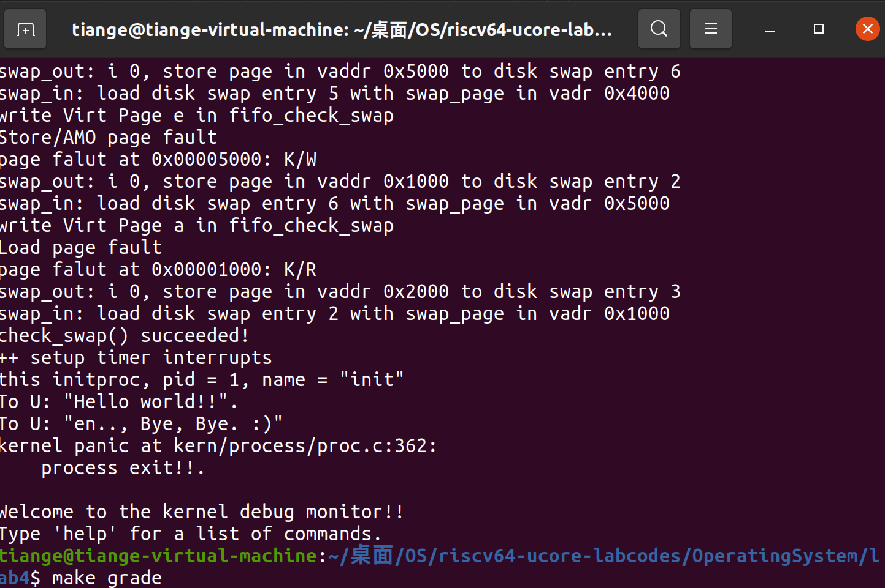
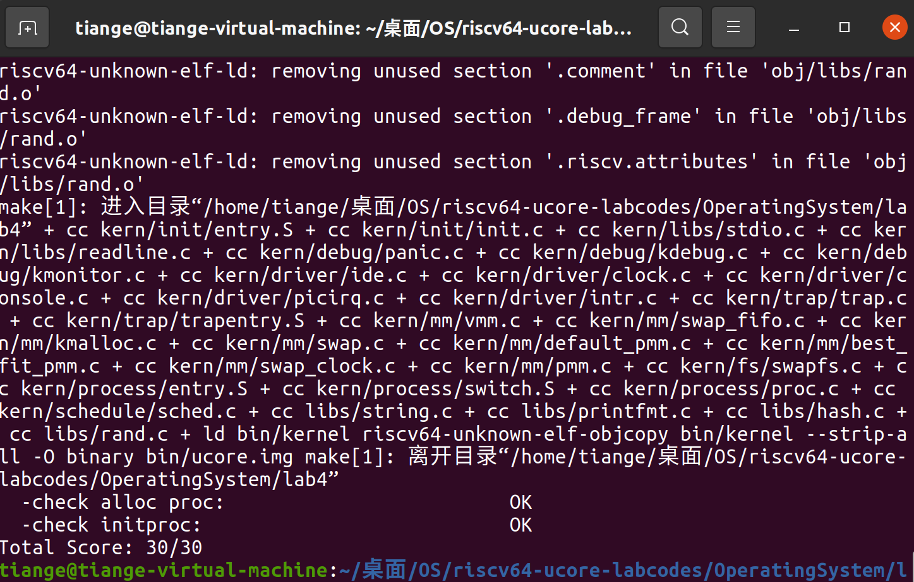

[TOC]

# lab 4 进程管理

**小组成员：徐亚民，肖胜杰，张天歌**

## 练习1：分配并初始化一个进程控制块

### 编程实现

```cpp
// 初始化进程的状态为 PROC_UNINIT，表示该进程尚未初始化完成
proc->state = PROC_UNINIT;
// 初始化进程ID为 -1，表示未分配有效进程ID
proc->pid = -1;
// 进程的运行次数初始化为 0，表示进程尚未运行
proc->runs = 0;
// 内核栈初始化为 0，表示该进程的内核栈尚未分配
proc->kstack = 0;
// 设置进程需要重新调度的标志为 0，表示当前不需要调度
proc->need_resched = 0;
// 初始化进程的父进程为 NULL，表示没有父进程（通常是 init 进程）
proc->parent = NULL;
// 进程的内存管理结构体 (mm_struct) 初始化为 NULL，表示没有内存管理信息
proc->mm = NULL;
// 将进程的上下文 (context) 清零，为了保证没有遗留的状态
memset(&(proc->context), 0, sizeof(struct context));
// 初始化进程的陷阱帧 (trapframe) 为 NULL，表示该进程还没有陷入中断或系统调用
proc->tf = NULL;
// 设置进程的 CR3 寄存器为 boot_cr3，通常是系统启动时的页目录表基地址
proc->cr3 = boot_cr3;
// 初始化进程的标志位为 0，表示没有特殊的进程标志
proc->flags = 0;
// 清空进程名称的字符串，确保没有随机的字符，长度为 PROC_NAME_LEN + 1
memset(proc->name, 0, PROC_NAME_LEN + 1);
```

### `struct context context` 和 `struct trapframe *tf` 的作用

在 `proc_struct` 结构体中，`struct context context` 和 `struct trapframe *tf` 都是与进程调度和上下文切换相关的关键字段。它们分别代表进程切换时的寄存器保存和中断/系统调用时的状态保存。以下是对这两个成员变量的详细解释和它们在实验中的作用。

#### 1. `struct context context`

`context` 结构体用于保存进程上下文，特别是在进行进程切换时，需要保存和恢复的寄存器值。它包含了进程的所有重要寄存器状态，以便操作系统能够在进程切换时保存当前进程的状态，并恢复另一个进程的状态，从而实现多任务处理。

- **保存进程的寄存器状态：** 当操作系统需要切换当前执行的进程时，它会将当前进程的寄存器（如通用寄存器、程序计数器等）保存到 `context` 中，并加载新的进程的寄存器状态来继续执行。
- **进程切换时恢复状态：** 在进行进程切换时（例如，由调度程序选择了一个新的进程来执行），操作系统会使用 `context` 中保存的寄存器值恢复新进程的状态，确保新进程从正确的位置继续执行。

在一个简单的操作系统中，进程切换是通过保存和恢复上下文来实现的。当一个进程被抢占或发生调度时，操作系统会将当前进程的状态保存到 `context` 结构中，然后从新进程的 `context` 结构中恢复它的寄存器状态。这是进行任务切换的核心机制。

#### 2. `struct trapframe *tf`

`trapframe` 是用于保存进程在中断或异常发生时的状态信息的数据结构。它主要保存了进程在发生中断、系统调用或者异常时的寄存器状态。每当进程在内核模式下进入系统调用或发生中断时，都会将寄存器状态保存到一个 `trapframe` 结构体中。

- **保存中断或异常的状态：** 当进程从用户态切换到内核态（比如发生系统调用或中断），CPU 会将一些关键的寄存器（如程序计数器、堆栈指针等）保存到 `trapframe` 中。这样操作系统就能知道在处理中断或系统调用时，如何恢复原进程的执行状态。
- **系统调用的上下文保存：** 在发生系统调用时，操作系统需要保存当前进程的状态，以便处理完系统调用后能够恢复执行。而 `trapframe` 就是保存这些状态的地方。

在本实验中，当进程执行系统调用、触发中断或异常时，操作系统会创建一个 `trapframe`，并将当前进程的寄存器状态保存在其中。这个结构在进程从用户态切换到内核态时发挥重要作用。当内核处理完中断或系统调用后，会恢复 `trapframe` 中保存的寄存器状态，从而继续执行原进程。

#### 总结：
- **`struct context context`** 主要用于保存进程的上下文（即寄存器状态）以便在进程切换时能够恢复执行。
- **`struct trapframe *tf`** 主要用于保存进程在中断或系统调用过程中需要保存的状态，特别是在进程从用户态切换到内核态时。

在实验中，`context` 用于支持进程间的调度和上下文切换，而 `trapframe` 用于保存和恢复进程在发生中断、异常或系统调用时的状态。两者配合使用，确保进程切换和系统调用的上下文能够正确保存和恢复。

## 练习2：为新创建的内核线程分配资源（需要编码）

> 创建一个内核线程需要分配和设置好很多资源。kernel_thread函数通过调用**do_fork**函数完成具体内核线程的创建工作。do_kernel函数会调用alloc_proc函数来分配并初始化一个进程控制块，但alloc_proc只是找到了一小块内存用以记录进程的必要信息，并没有实际分配这些资源。ucore一般通过do_fork实际创建新的内核线程。do_fork的作用是，创建当前内核线程的一个副本，它们的执行上下文、代码、数据都一样，但是存储位置不同。因此，我们**实际需要"fork"的东西就是stack和trapframe**。在这个过程中，需要给新内核线程分配资源，并且复制原进程的状态。你需要完成在kern/process/proc.c中的do_fork函数中的处理过程。它的大致执行步骤包括：
>
> - 调用alloc_proc，首先获得一块用户信息块。
> - 为进程分配一个内核栈。
> - 复制原进程的内存管理信息到新进程（但内核线程不必做此事）
> - 复制原进程上下文到新进程
> - 将新进程添加到进程列表
> - 唤醒新进程
> - 返回新进程号
>
> 请在实验报告中简要说明你的设计实现过程。请回答如下问题：
>
> - 请说明ucore是否做到给每个新fork的线程一个唯一的id？请说明你的分析和理由。

## 练习3：编写proc_run 函数（需要编码）

> proc_run用于将指定的进程切换到CPU上运行。它的大致执行步骤包括：
>
> - 检查要切换的进程是否与当前正在运行的进程相同，如果相同则不需要切换。
> - 禁用中断。你可以使用`/kern/sync/sync.h`中定义好的宏`local_intr_save(x)`和`local_intr_restore(x)`来实现关、开中断。
> - 切换当前进程为要运行的进程。
> - 切换页表，以便使用新进程的地址空间。`/libs/riscv.h`中提供了`lcr3(unsigned int cr3)`函数，可实现修改CR3寄存器值的功能。
> - 实现上下文切换。`/kern/process`中已经预先编写好了`switch.S`，其中定义了`switch_to()`函数。可实现两个进程的context切换。
> - 允许中断。
>
> 请回答如下问题：
>
> - 在本实验的执行过程中，创建且运行了几个内核线程？

### 3.1 schedule() 调度函数的运行机制

查找要切换的进程，需要用到`schd.c`文件中`schedule()`函数：

```cpp
void schedule(void) {
    bool intr_flag;//中断标志变量
    list_entry_t *le, *last;//工作指针：当前节点、下一节点
    struct proc_struct *next = NULL;//找到的要切换的进程
    local_intr_save(intr_flag);//禁止中断，确保调度过程不被外部中断打断
    {
        current->need_resched = 0;
        //检查是否是idle，如果是idle就从头开始找，否则从现在开始找
        last = (current == idleproc) ? &proc_list : &(current->list_link);
        le = last;

        do {//遍历proc_list，直到找到可以调度的进程
            if ((le = list_next(le)) != &proc_list) {
                next = le2proc(le, list_link);
                if (next->state == PROC_RUNNABLE) {
                    break;//找到一个可以调度的进程，结束循环
                }
            }
        } while (le != last);

        if (next == NULL || next->state != PROC_RUNNABLE) {
            next = idleproc;//未找到可以调度的进程，回到idle
        }

        next->runs ++;//该进程运行次数加一
        
        if (next != current) {
            proc_run(next);//调用proc_run函数运行新进程
        }
    }
    local_intr_restore(intr_flag);//中断允许
}
```

`schedule()` 函数的作用是选择下一个可运行的进程，并进行进程切换。这是一个简单的调度器实现，采用了 **FIFO (First In, First Out)** 调度算法。在调度过程中，基于 `proc_list` 双向链表管理所有进程：

1. **清除调度标志**：将 `current->need_resched` 置为 `0`，表示当前线程已完成调度。
2. **查找下一个进程**：设置le链表指针，如果当前进程是idle就从头开始找，否则从current进程链表开始找；遍历 `proc_list` 链表中查找下一个状态为 `PROC_RUNNABLE` 的进程。
3. **处理无可运行进程的情况**：如果没有找到可运行进程，将调度空闲进程 `idleproc`。
4. **执行进程切换：**
   - 更新新进程的运行计数器runs++。
   - 如果新进程与当前进程不同，则调用 `proc_run()` 切换到新进程。
5. **恢复中断**：完成调度后恢复系统中断。

### 3.2 lcr3页表基址切换

**1. 内核线程统一使用内核页目录表的基址 (`boot_cr3`)**

- **`boot_cr3`** 是内核进程的统一页表根节点地址，指向物理内存中全局的页表。
- 该页表包含内核所有虚拟地址到物理地址的映射，用于内核线程的地址翻译。

**2. `lcr3` 函数** 是一个内联汇编函数，用于直接操作 RISC-V 的 **`sptbr` CSR（控制状态寄存器）**，实现页表基址的切换：**将页表基址设置为 `proc->cr3` 对应的物理地址**，指向当前进程的页表，并且 **更新 页表基址寄存器 (`sptbr`) 寄存器**（ Supervisor Page Table Base Register），让 CPU 开始使用新页表进行地址转换。

```c
static inline void
lcr3(unsigned int cr3) {
    write_csr(sptbr, SATP32_MODE | (cr3 >> RISCV_PGSHIFT));
}
```

### 3.3 上下文切换

上下文切换通过 `switch_to` **保存当前进程的 callee-saved 寄存器**到其上下文结构体，并**恢复目标进程的寄存器状态**；随后通过中断帧 `trapframe` 恢复程序计数器等状态，跳转到目标进程的执行位置继续运行。

```assembly
.text
# void switch_to(struct proc_struct* from, struct proc_struct* to)
.globl switch_to
switch_to:
    # save from's registers
    STORE ra, 0*REGBYTES(a0)
    STORE sp, 1*REGBYTES(a0)
    STORE s0, 2*REGBYTES(a0)
    STORE s1, 3*REGBYTES(a0)
    STORE s2, 4*REGBYTES(a0)
    STORE s3, 5*REGBYTES(a0)
    STORE s4, 6*REGBYTES(a0)
    STORE s5, 7*REGBYTES(a0)
    STORE s6, 8*REGBYTES(a0)
    STORE s7, 9*REGBYTES(a0)
    STORE s8, 10*REGBYTES(a0)
    STORE s9, 11*REGBYTES(a0)
    STORE s10, 12*REGBYTES(a0)
    STORE s11, 13*REGBYTES(a0)

    # restore to's registers
    LOAD ra, 0*REGBYTES(a1)
    LOAD sp, 1*REGBYTES(a1)
    LOAD s0, 2*REGBYTES(a1)
    LOAD s1, 3*REGBYTES(a1)
    LOAD s2, 4*REGBYTES(a1)
    LOAD s3, 5*REGBYTES(a1)
    LOAD s4, 6*REGBYTES(a1)
    LOAD s5, 7*REGBYTES(a1)
    LOAD s6, 8*REGBYTES(a1)
    LOAD s7, 9*REGBYTES(a1)
    LOAD s8, 10*REGBYTES(a1)
    LOAD s9, 11*REGBYTES(a1)
    LOAD s10, 12*REGBYTES(a1)
    LOAD s11, 13*REGBYTES(a1)

    ret
```

### 3.4 proc_run函数实现

```CPP
void proc_run(struct proc_struct *proc) {
    if (proc != current) {
       // 中断标志符
       bool intr_flag;
       struct proc_struct *prev = current;// prev指向当前正在运行的进程
       local_intr_save(intr_flag);// 设置中断禁止
       {
        current = proc; // 记录当前进程
        lcr3(proc->cr3);//修改页表基址的地址
        switch_to(&(prev->context), &(proc->context));// 切换上下文状态
       }
       local_intr_restore(intr_flag); // 设置中断启用
    }
}
```

1. **禁用中断**：通过 `local_intr_save` 禁用中断，确保切换过程不被异常打断。
2. **更新当前进程指针**：将 `current` 更新为目标进程指针 `proc`，记录切换前后的进程。
3. **切换页表基址**：调用 `lcr3` 切换到目标进程的页表基址以使用其地址空间。
4. **上下文切换**：调用 `switch_to` 保存当前进程的上下文并恢复目标进程的上下文。
5. **启用中断**：通过 `local_intr_restore` 恢复中断状态，完成切换。

### 问题回答：在本实验的执行过程中，创建且运行了几个内核线程？

运行了两个内核线程：

1. idle_thread：这个内核线程的工作就是不停地查询，看是否有其他内核线程可以执行了，如果有，马上让调度器选择那个内核线程执行。在这个实验中，先启动idle，后设置init为RUNNABLE，便可以将运行权交给init进程。
2. init_thread：该内核线程的工作就是显示“Hello World”，表明自己存在且能正常工作了，表明初始化进程的工作成功了。

### 运行截图





## 扩展练习 Challenge：

> 说明语句`local_intr_save(intr_flag);....local_intr_restore(intr_flag);`是如何实现开关中断的？

相关函数如下:

```CPP
static inline bool __intr_save(void) {
    if (read_csr(sstatus) & SSTATUS_SIE) {
        intr_disable();
        return 1;
    }
    return 0;
}

static inline void __intr_restore(bool flag) {
    if (flag) {
        intr_enable();
    }
}

#define local_intr_save(x)      do { x = __intr_save(); } while (0)
#define local_intr_restore(x)   __intr_restore(x);
```

`local_intr_save` 和 `local_intr_restore` 的实现通过检查和设置 `sstatus` CSR 寄存器中的 `SIE` 位（中断使能位），实现了安全的中断开关功能：

### 关闭中断 (`local_intr_save`)：

- 调用 `__intr_save()`检查当前中断状态：
  - 如果中断开启 (`SSTATUS_SIE = 1`)，调用 `intr_disable()` 关闭中断，并返回 `1`。
  - 如果中断已关闭，直接返回 `0`。
- 返回值存储在变量中，用于记录原始的中断状态。

### 恢复中断 (`local_intr_restore`)：

- 调用 `__intr_restore()`检查记录的中断状态：
  - 如果原始状态是开启 (`flag = 1`)，调用 `intr_enable()` 重新开启中断。
  - 如果原始状态是关闭 (`flag = 0`)，保持中断关闭。

**intr_enable**和**intr_disable**的处理如下:

```cpp
/* intr_enable - enable irq interrupt */
void intr_enable(void) { set_csr(sstatus, SSTATUS_SIE); }

/* intr_disable - disable irq interrupt */
void intr_disable(void) { clear_csr(sstatus, SSTATUS_SIE); }
```


## 知识点分析

### 实验知识点

#### 总结进程上下文切换的流程

**1. 上下文切换的目标**

上下文切换的目标是保存当前进程的状态（包括寄存器值），并恢复下一个进程的状态，使下一个进程能够继续执行。

**2. 关键组件**

1. **`proc->context`**: 保存进程的上下文（callee-saved 寄存器）。
2. **`proc->tf`**: 存储进程的中断帧（trapframe），包括异常返回点和寄存器状态。
3. **`kernel_thread_entry`**: 新内核线程的入口点。
4. **`switch_to`**: 上下文切换的核心函数，用汇编实现保存和恢复进程状态。
5. **`forkret` 和 `__trapret`**: 用于恢复中断帧并进入内核线程执行。

**3. 流程详解**

##### **3.1 创建新内核线程**

通过 `kernel_thread` 函数创建新线程：

1. 初始化临时的中断帧 **tf**：
   - **`s0`** 设置为内核线程函数地址 `fn`。
   - **`s1`** 设置为传递给线程的参数 `arg`。
   - **`epc`** 设置为 `kernel_thread_entry`，表示线程的入口。
   - 设置状态寄存器 `sstatus` 以启用 S 模式并允许中断。
2. 调用 `do_fork`，在子进程的内核栈中分配并复制 `tf`。

------

##### **3.2 复制线程上下文**

通过 `copy_thread` 函数完成：

1. 将临时中断帧 `tf` 复制到目标进程的内核栈中，并设置为 `proc->tf`。
2. 将目标进程的上下文 `proc->context`设置为：
   - **`ra`** 指向 `forkret` 函数。
   - **`sp`** 指向 `proc->tf`。

------

##### **3.3 上下文切换**

1. 调用 `switch_to`实现上下文切换：
   - **保存当前进程的上下文（callee-saved 寄存器）**： 使用 `STORE` 指令将 `ra`、`sp` 和 `s0-s11` 寄存器保存到当前进程的 `proc->context` 中（`a0` 指向）。
   - **恢复目标进程的上下文**： 使用 `LOAD` 指令从目标进程的 `proc->context` 中恢复 `ra`、`sp` 和 `s0-s11` 寄存器（`a1` 指向）。
   - 返回到目标进程的 `ra`，即 `forkret` 函数。

------

##### **3.4 恢复中断帧**

`forkret` 恢复中断帧并跳转到新线程入口：

1. 将目标进程的 `trapframe` 地址加载到 `sp`。
2. 调用 `__trapret`
   - 通过 `epc` 跳转到 `kernel_thread_entry`。
   - 恢复进程的中断帧寄存器状态。

------

##### **3.5 进入线程执行**

在 `kernel_thread_entry` 中：

1. 将 `s1`（线程参数）移动到 `a0`。
2. 跳转到 `s0`（线程函数地址）开始执行。
3. 线程执行完毕后调用 `do_exit` 结束进程。

### 课堂知识点