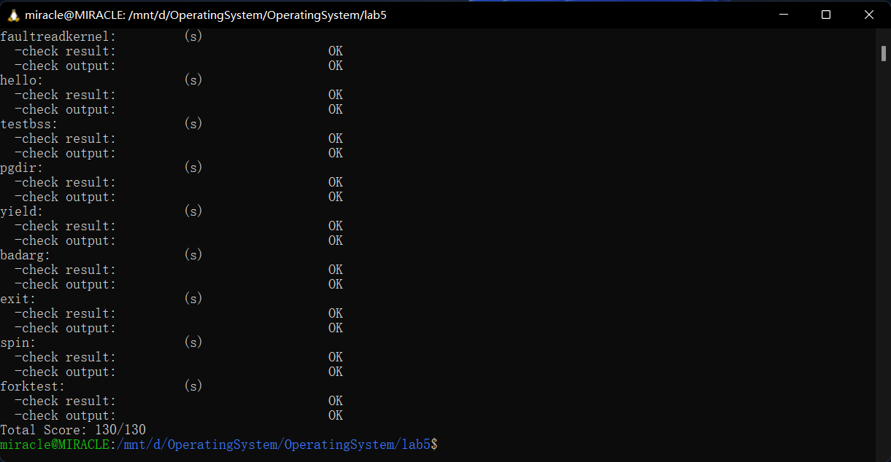
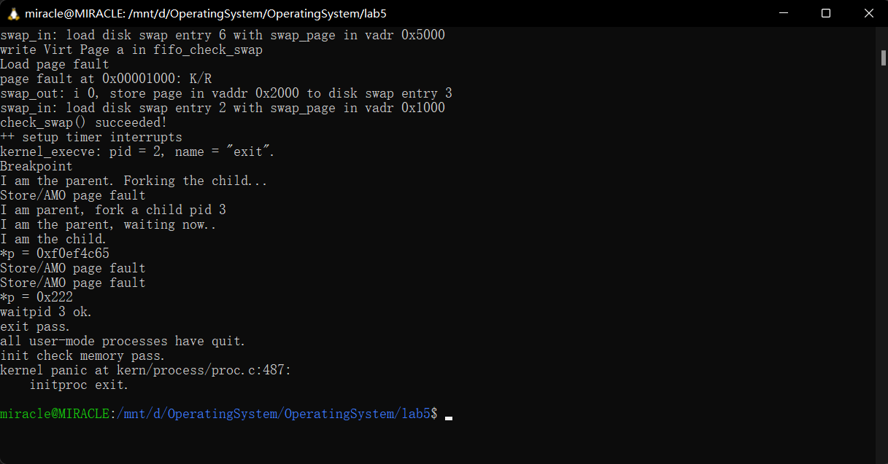

- [lab 5 用户程序](#lab-5-用户程序)
  - [练习0：填写已有实验](#练习0填写已有实验)
  - [练习1: 加载应用程序并执行](#练习1-加载应用程序并执行)
    - [1.1编程实现：](#11编程实现)
    - [1.2简要描述简要描述这个用户态进程被`ucore`选择占用CPU执行（RUNNING态）到具体执行应用程序第一条指令的整个经过：](#12简要描述简要描述这个用户态进程被ucore选择占用cpu执行running态到具体执行应用程序第一条指令的整个经过)
  - [练习2: 父进程复制自己的内存空间给子进程](#练习2-父进程复制自己的内存空间给子进程)
    - [2.1`copy_range`函数设计实现过程：](#21copy_range函数设计实现过程)
    - [2.2设计实现`Copy on Write`机制：](#22设计实现copy-on-write机制)
  - [练习3: 阅读分析源代码，理解进程执行 fork/exec/wait/exit 的实现，以及系统调用的实现](#练习3-阅读分析源代码理解进程执行-forkexecwaitexit-的实现以及系统调用的实现)
    - [3.1`fork/exec/wait/exit`函数的分析](#31forkexecwaitexit函数的分析)
    - [3.2 `fork/exec/wait/exit`函数执行流程](#32-forkexecwaitexit函数执行流程)
    - [3.3 执行状态生命周期图](#33-执行状态生命周期图)
  - [扩展练习 Challenge](#扩展练习-challenge)
    - [COW实现代码](#cow实现代码)
      - [1. 创建失败时执行，这两项与`proc.c`中相同：](#1-创建失败时执行这两项与procc中相同)
      - [2. `vmm.c`文件中`do_pgfault`中添加判断页表项权限：](#2-vmmc文件中do_pgfault中添加判断页表项权限)
      - [3. `proc.c`文件中`do_fork`函数中的`copy_mm`改为`cow_copy_mm`：](#3-procc文件中do_fork函数中的copy_mm改为cow_copy_mm)
      - [4. 复制虚拟内存空间：](#4-复制虚拟内存空间)
      - [5. 只复制`mm`与`vma`，将页表项均指向原来的页：](#5-只复制mm与vma将页表项均指向原来的页)
      - [6. 设置页表项指向：](#6-设置页表项指向)
      - [7. 实现COW的缺页异常处理：](#7-实现cow的缺页异常处理)
    - [由于COW实现比较复杂，容易引入bug，请参考 https://dirtycow.ninja/ 看看能否在ucore的COW实现中模拟这个错误和解决方案。需要有解释。](#由于cow实现比较复杂容易引入bug请参考-httpsdirtycowninja-看看能否在ucore的cow实现中模拟这个错误和解决方案需要有解释)
      - [1. 在`user/exit.c`文件中添加](#1-在userexitc文件中添加)
      - [2. 如果使用原本的策略，执行`make qemu`会提示：](#2-如果使用原本的策略执行make-qemu会提示)
      - [3. 但是如果使用COW策略，则会正常运行：](#3-但是如果使用cow策略则会正常运行)
    - [说明该用户程序是何时被预先加载到内存中的？与我们常用操作系统的加载有何区别，原因是什么？](#说明该用户程序是何时被预先加载到内存中的与我们常用操作系统的加载有何区别原因是什么)

# lab 5 用户程序

**小组成员：徐亚民，肖胜杰，张天歌**

## 练习0：填写已有实验

`alloc_proc`函数更改：

```cpp
//lab5新增
proc->wait_state = 0;
proc->cptr = NULL; // Child Pointer 表示当前进程的子进程
proc->optr = NULL; // Older Sibling Pointer 表示当前进程的上一个兄弟进程
proc->yptr = NULL; // Younger Sibling Pointer 表示当前进程的下一个兄弟进程
```

`do_fork`更改：其中`set_links()`为实验五新增用户进程关系函数

```c++
   /*    -------------------
    *    update step 1: set child proc's parent to current process, make sure current process's wait_state is 0
    *    update step 5: insert proc_struct into hash_list && proc_list, set the relation links of process
    */

    proc = alloc_proc();                // 分配并初始化一个新的进程结构体
    proc->parent = current;             // 设置新进程的父进程为当前进程
    assert(current->wait_state == 0);
    setup_kstack(proc);                 // 为新进程设置内核栈
    copy_mm(clone_flags, proc);         // 复制父进程的内存管理信息到新进程
    copy_thread(proc, stack, tf);       // 复制线程信息，包括栈和寄存器状态 
    bool intr_flag;
    local_intr_save(intr_flag);
    {
        int pid = get_pid();           // 获取一个新的进程ID
        proc->pid = pid;               // 设置新进程的进程ID 
        hash_proc(proc);               //将proc_struct插入hash_list && proc_list
        set_links(proc);
    }
    local_intr_restore(intr_flag);
    wakeup_proc(proc);              // 调用wakeup_proc使新子进程RUNNABLE
    ret = proc->pid;                  // 返回新进程的进程ID
 
```

## 练习1: 加载应用程序并执行

### 1.1编程实现：

```cpp
    //(6) setup trapframe for user environment
    struct trapframe *tf = current->tf;
    // Keep sstatus
    uintptr_t sstatus = tf->status;
    memset(tf, 0, sizeof(struct trapframe));
    /* LAB5:EXERCISE1 YOUR CODE: 2211123
     * should set tf->gpr.sp, tf->epc, tf->status
     * NOTICE: If we set trapframe correctly, then the user level process can return to USER MODE from kernel. 
     */
    tf->gpr.sp = USTACKTOP;
    tf->epc = elf-> e_entry;
    //用户态下，sstatus的SPP位清零，代表异常来自用户态，之后需要返回用户态；SPIE位清零，表示不启用中断。
    tf->status = (read_csr(sstatus) & ~SSTATUS_SPP & ~SSTATUS_SPIE);
```

这三行代码设计的核心目标是正确地初始化 `trapframe` 中的关键字段，以确保用户程序能够正常从内核模式切换到用户模式，并且在需要时能够正确返回内核模式。下面是每一行代码的设计思路和背景：

**1. tf->gpr.sp = USTACKTOP;**

- **设计思路**: 设置用户程序的栈顶地址，确保在用户程序运行时，栈指针（SP）指向一个有效的用户栈空间。
- **背景**: 操作系统为新用户进程分配独立的栈空间，并将 `sp` 初始化为栈顶位置，避免无效指针引发异常。

**2. tf->epc = elf->e_entry;**

- **设计思路**: 提取 ELF 的 `e_entry` 字段，设置到 `epc`，确保用户程序的控制流从正确的地址开始。
- **背景:**
  - ELF 文件（可执行与链接格式）是用户程序的载体，`e_entry` 字段定义了程序的入口点。
  - 在加载用户程序时，操作系统需要解析 ELF 文件，提取 `e_entry` 值，用于初始化进程的 `epc`。
  - 当执行 `sret`（从陷阱返回）指令时，硬件会根据 `epc` 的值跳转到用户程序的入口执行指令。

**3. tf->status = sstatus & ~(SSTATUS_SPP | SSTATUS_SPIE);**

- **设计目的**: 初始化状态寄存器（`status`），确保正确的特权模式和中断设置，使得用户程序能够在用户模式（U-Mode）下安全运行。
- 背景:
  - `SSTATUS_SPP`（Supervisor Previous Privilege Level）:
    - 控制从陷阱返回后，处理器返回的特权模式。
    - 置 0 表示返回用户模式（U-Mode）；置 1 表示返回管理模式（S-Mode）。
    - 在初始化用户程序时，需要清除 `SSTATUS_SPP` 位，以确保通过 `sret` 指令从内核返回用户模式。
  - `SSTATUS_SPIE`（Supervisor Previous Interrupt Enable）:
    - 控制从陷阱返回后，中断是否启用。
    - 设置为 1 表示允许中断；清除为 0 表示禁用中断。
    - 在初始化用户程序时，需要清除该位，以确保从陷阱返回后中断逻辑正确。
- 设计思路:
  - 使用位运算（清除 SSTATUS_SPP和 SSTATUS_SPIE）确保硬件在执行 `sret`时：
    - 切换到用户模式（U-Mode）
    - 恢复用户模式下的中断状态。。

### 1.2简要描述简要描述这个用户态进程被`ucore`选择占用CPU执行（RUNNING态）到具体执行应用程序第一条指令的整个经过：

当 `init` 进程将用户态进程创建完毕后，整个用户态进程从被调度运行到执行用户程序第一条指令的过程如下：

1. **创建并唤醒线程**：
    在 `init_main` 中，通过 `kernel_thread` 调用 `do_fork` 创建用户态进程，并唤醒线程，线程状态变为 `PROC_RUNNABLE`，表示线程可以运行。
2. **调度执行 `user_main`**：
    调度器选择该进程运行，进入 `user_main` 函数。在 `user_main` 中，通过宏 `KERNEL_EXECVE` 调用 `kernel_execve`。
3. **触发断点异常**：
    `kernel_execve` 通过执行 `ebreak` 指令触发断点异常。控制权转移到中断入口 `__alltraps`，随后依次进入 `trap`、`trap_dispatch` 和 `exception_handler`。
4. **执行系统调用 `sys_exec`**：
    在 `CAUSE_BREAKPOINT` 处，通过 `syscall` 函数，根据系统调用号，进入 `sys_exec`，随后调用 `do_execve`。
5. **加载用户程序**：
    在 `do_execve` 中调用 `load_icode`，完成用户程序的加载。具体步骤包括：
   - 回收当前进程内存空间；
   - 加载 ELF 文件，将用户程序段映射到内存；
   - 设置用户栈顶 (`tf->gpr.sp = USTACKTOP`)；
   - 设置程序入口点 (`tf->epc = elf->e_entry`)；
   - 配置用户态寄存器状态 (`tf->status = sstatus & ~(SSTATUS_SPP | SSTATUS_SPIE)`)，确保中断返回后切换到用户态。
6. **中断返回**：
    加载完成后，通过中断处理流程返回，在 `__trapret` 中调用 `sret` 指令完成从内核态到用户态的切换，开始执行用户程序的入口指令。

## 练习2: 父进程复制自己的内存空间给子进程

### 2.1`copy_range`函数设计实现过程：

首先获取源地址和目的地址对应的内核虚拟地址，然后拷贝内存，最后将拷贝完成的页插入到页表中。

```
uintptr_t* src = page2kva(page);  // 将页面 `page` 转换为内核虚拟地址，得到指向该页面内容的指针 `src`
uintptr_t* dst = page2kva(npage); // 将页面 `npage` 转换为内核虚拟地址，得到指向该页面内容的指针 `dst`
memcpy(dst, src, PGSIZE);          // 将 `src` 页面中的内容复制到 `dst` 页面中，复制的字节数为 `PGSIZE`（即一个页面的大小）
ret = page_insert(to, npage, start, perm); // 将 `npage` 页面插入到 `to` 地址空间中的 `start` 地址，设置访问权限为 `perm`
```

### 2.2设计实现`Copy on Write`机制：

1. 在fork时，将父线程的所有页表项设置为只读，在新线程的结构中只复制栈和虚拟内存的页表，不为其分配新的页。
   
2. 切换到子线程执行时，如果子线程需要修改一页的内容，会访问页表，由于该页不允许被修改，所以会引发异常。
   
3. 异常处理部分，遇到该类异常，重新分配一块空间，将访问的页面复制进去，更新子线程的页表项。


## 练习3: 阅读分析源代码，理解进程执行 fork/exec/wait/exit 的实现，以及系统调用的实现

### 3.1`fork/exec/wait/exit`函数的分析

1. `fork`：通过发起系统调用执行`do_fork`函数。用于创建并唤醒线程，可以通过`sys_fork`或者`kernel_thread`调用。
   + 初始化一个新线程
   + 为新线程分配内核栈空间
   + 为新线程分配新的虚拟内存或与其他线程共享虚拟内存
   + 获取原线程的上下文与中断帧，设置当前线程的上下文与中断帧
   + 将新线程插入哈希表和链表中
   + 唤醒新线程
   + 返回线程`id`
2. `exec`：通过发起系统调用执行`do_execve`函数。用于创建用户空间，加载用户程序，可以通过`sys_exec`调用。
   + 回收当前线程的虚拟内存空间
   + 为当前线程分配新的虚拟内存空间并加载应用程序
3. `wait`：通过发起系统调用执行`do_wait`函数。用于等待线程完成，可以通过`sys_wait`或者`init_main`调用。
   + 查找状态为`PROC_ZOMBIE`的子线程；如果查询到拥有子线程的线程，则设置线程状态并切换线程；如果线程已退出，则调用`do_exit`
   + 将线程从哈希表和链表中删除
   + 释放线程资源
4. `exit`：通过发起系统调用执行`do_exit`函数。用于退出线程，可以通过`sys_exit`、`trap`、`do_execve`、`do_wait`调用。具体执行内容：
   + 如果当前线程的虚拟内存没有用于其他线程，则销毁该虚拟内存
   + 将当前线程状态设为`PROC_ZOMBIE`，唤醒该线程的父线程
   + 调用`schedule`切换到其他线程

### 3.2 `fork/exec/wait/exit`函数执行流程

+ 系统调用部分在内核态进行，用户程序的执行在用户态进行
+ 内核态通过系统调用结束后的`sret`指令切换到用户态，用户态通过发起系统调用产生`ebreak`异常切换到内核态
+ 内核态执行的结果通过`kernel_execve_ret`将中断帧添加到线程的内核栈中，从而将结果返回给用户


### 3.3 执行状态生命周期图

```shell
                    +-------------+
               +--> |	 none 	  |
               |    +-------------+       ---+
               |          | alloc_proc	     |
               |          V				     |
               |    +-------------+			 |
               |    | PROC_UNINIT |			 |---> do_fork
               |    +-------------+			 |
      do_wait  |         | wakeup_proc		 |
               |         V			   	  ---+
               |    +-------------+    do_wait 	  	  +-------------+
               |    |PROC_RUNNABLE| <------------>    |PROC_SLEEPING|
               |    +-------------+    wake_up        +-------------+
               |         | do_exit
               |         V
               |    +-------------+
               +--- | PROC_ZOMBIE |
                    +-------------+
```

## 扩展练习 Challenge

实现 Copy on Write （COW）机制：给出实现源码, 测试用例和设计报告（包括在cow情况下的各种状态转换（类似有限状态自动机）的说明）。

这个扩展练习涉及到本实验和上一个实验“虚拟内存管理”。在ucore操作系统中，当一个用户父进程创建自己的子进程时，父进程会把其申请的用户空间设置为只读，子进程可共享父进程占用的用户内存空间中的页面（这就是一个共享的资源）。当其中任何一个进程修改此用户内存空间中的某页面时，ucore会通过page fault异常获知该操作，并完成拷贝内存页面，使得两个进程都有各自的内存页面。这样一个进程所做的修改不会被另外一个进程可见了。请在ucore中实现这样的COW机制。

### COW实现代码

COW的主体部分均放在`cow.c`文件中。写时复制（COW） 是一种内存管理技术，目的是在进程复制时避免不必要的内存分配。父子进程可以共享同一块内存区域，只有在子进程试图修改共享内存时，才会为其分配一份新的物理页面。通过这种机制，多个进程可以共享只读内存（例如代码段），而在需要修改内存时才进行实际的复制操作，从而节省了内存空间并提高了效率。

#### 1. 创建失败时执行，这两项与`proc.c`中相同：

```c
// 设置进程的页目录
static int
setup_pgdir(struct mm_struct *mm) {
    // 定义一个指向Page结构体的指针，用于存储分配的内存页面
    struct Page *page;
    // 尝试分配一页物理内存，如果失败则返回内存不足的错误
    if ((page = alloc_page()) == NULL) {
        return -E_NO_MEM;  // 返回-ENOMEM，表示内存分配失败
    }
    // 获取分配到的物理页面的内核虚拟地址，并将该地址赋值给页目录指针
    pde_t *pgdir = page2kva(page);
    // 将启动时的页目录（boot_pgdir）内容拷贝到新的页目录中
    memcpy(pgdir, boot_pgdir, PGSIZE);
    // 将新创建的页目录的地址赋给进程的页目录字段
    mm->pgdir = pgdir;
    // 返回0，表示成功设置页目录
    return 0;
}
// 释放进程的页目录所占的物理内存
static void
put_pgdir(struct mm_struct *mm) {
    // 将进程的页目录（虚拟地址）转换成对应的物理页面，并释放这页物理内存
    free_page(kva2page(mm->pgdir));
}
```

#### 2. `vmm.c`文件中`do_pgfault`中添加判断页表项权限：

```c
// 判断页表项权限，如果有效但是不可写，跳转到COW（写时复制）
if ((ptep = get_pte(mm->pgdir, addr, 0)) != NULL) {  // 获取指定地址的页表项
    // 判断页表项是否有效且不可写，PTE_V表示页表项有效，PTE_W表示页表项可写
    if((*ptep & PTE_V) & ~(*ptep & PTE_W)) {
        // 如果页表项有效且不可写，执行写时复制（COW）操作
        return cow_pgfault(mm, error_code, addr); 
    }
}
```

#### 3. `proc.c`文件中`do_fork`函数中的`copy_mm`改为`cow_copy_mm`：

```c
// 原来使用 copy_mm 来复制进程的内存管理结构体
// if(copy_mm(clone_flags, proc) != 0) {
//     goto bad_fork_cleanup_kstack;
// }
// 改为使用 cow_copy_mm 来实现写时复制（COW）内存管理的复制
if(cow_copy_mm(proc) != 0) {
    // 如果 COW 复制失败，则进行错误处理，跳转到清理栈的逻辑
    goto bad_fork_cleanup_kstack;
}
```

#### 4. 复制虚拟内存空间：

```c
// 复制虚拟内存空间（COW拷贝内存）
int
cow_copy_mm(struct proc_struct *proc) {
    // 定义当前进程的内存管理结构指针和旧进程的内存管理结构指针
    struct mm_struct *mm, *oldmm = current->mm;
    /* current is a kernel thread */
    // 如果当前进程没有用户空间（即是内核线程），直接返回0
    if (oldmm == NULL) {
        return 0;
    }
    // 定义返回值
    int ret = 0;
    // 创建新的内存管理结构，如果创建失败，则跳转到bad_mm
    if ((mm = mm_create()) == NULL) {
        goto bad_mm;
    }
    // 设置新的页目录，若失败则跳转到bad_pgdir_cleanup_mm
    if (setup_pgdir(mm) != 0) {
        goto bad_pgdir_cleanup_mm;
    }
    // 锁住旧进程的内存管理结构，防止并发修改
    lock_mm(oldmm);
    {
        // 复制旧进程的内存映射（COW策略）
        ret = cow_copy_mmap(mm, oldmm);
    }
    // 解锁旧进程的内存管理结构
    unlock_mm(oldmm);
    // 如果内存映射复制失败，则跳转到bad_dup_cleanup_mmap
    if (ret != 0) {
        goto bad_dup_cleanup_mmap;
    }
good_mm:
    // 增加新内存管理结构的引用计数
    mm_count_inc(mm);
    // 设置新进程的内存管理结构
    proc->mm = mm;
    // 设置新进程的页目录物理地址（cr3寄存器）
    proc->cr3 = PADDR(mm->pgdir);
    return 0;
bad_dup_cleanup_mmap:
    // 清理内存映射并释放页目录
    exit_mmap(mm);
    put_pgdir(mm);
bad_pgdir_cleanup_mm:
    // 销毁新创建的内存管理结构
    mm_destroy(mm);
bad_mm:
    return ret;  // 返回错误代码
}
```

#### 5. 只复制`mm`与`vma`，将页表项均指向原来的页：

```c
int
cow_copy_mmap(struct mm_struct *to, struct mm_struct *from) {
    // 断言 to 和 from 都不为 NULL
    assert(to != NULL && from != NULL);
    // 初始化 mmap 列表，并设置 le 为从列表开始的位置
    list_entry_t *list = &(from->mmap_list), *le = list;
    // 遍历 from 的 mmap_list 列表，逐个复制虚拟内存区域（vma）
    while ((le = list_prev(le)) != list) {
        struct vma_struct *vma, *nvma;
        // 获取当前列表项对应的 vma 结构体
        vma = le2vma(le, list_link);
        // 创建一个新的 vma 结构，复制原 vma 的起始地址、结束地址和标志
        nvma = vma_create(vma->vm_start, vma->vm_end, vma->vm_flags);
        // 如果创建新的 vma 失败，返回内存不足的错误码
        if (nvma == NULL) {
            return -E_NO_MEM;
        }
        // 将新创建的 vma 插入到目标 mm_struct 的 vma 列表中
        insert_vma_struct(to, nvma);
        // 调用 cow_copy_range 函数，复制页表内容：将目标进程的页表指向原进程的相同地址范围
        // 即实现 "copy on write" 语义，复制指定的内存范围
        if (cow_copy_range(to->pgdir, from->pgdir, vma->vm_start, vma->vm_end) != 0) {
            return -E_NO_MEM;  // 如果复制失败，返回内存不足的错误码
        }
    }
    // 如果所有操作都成功，返回 0
    return 0;
}
```

#### 6. 设置页表项指向：

```c
int cow_copy_range(pde_t *to, pde_t *from, uintptr_t start, uintptr_t end) {
    // 断言起始地址和结束地址都为页对齐（即都能被 PGSIZE 整除）
    assert(start % PGSIZE == 0 && end % PGSIZE == 0);
    // 断言给定的地址范围是用户访问的地址空间
    assert(USER_ACCESS(start, end));
    // 从 start 到 end 遍历每一页，逐一设置页表项
    do {
        // 获取从源页表（from）中 start 地址处的页表项（ptep）
        pte_t *ptep = get_pte(from, start, 0);
        // 如果该页表项为空（即没有映射），则跳到下一页，继续处理
        if (ptep == NULL) {
            // 将 start 移动到下一页的页表项（页表项大小为 PTSIZE）
            start = ROUNDDOWN(start + PTSIZE, PTSIZE);
            continue;
        }
        // 如果该页表项有效（PTE_V 表示该页表项有效），则进行复制
        if (*ptep & PTE_V) {
            // 清除 PTE_W 标志，禁止写权限（启用写时复制 COW）
            *ptep &= ~PTE_W;
            // 获取当前页的权限，保留用户权限并去除写权限
            uint32_t perm = (*ptep & PTE_USER & ~PTE_W);
            // 从页表项中获取对应的物理页（struct Page）
            struct Page *page = pte2page(*ptep);
            // 断言该页存在（即对应的物理页不为空）
            assert(page != NULL);
            // 将该物理页插入目标页表（to），并设置合适的权限
            int ret = page_insert(to, page, start, perm);
            // 断言插入操作成功
            assert(ret == 0);
        }
        // 将 start 指针向前移动一页大小（PGSIZE），处理下一页
        start += PGSIZE;
    } while (start != 0 && start < end);  // 遍历直到 start 达到 end 或溢出
    // 返回 0，表示操作成功
    return 0;
}
```

#### 7. 实现COW的缺页异常处理：

```c
// 处理写时复制（COW）缺页异常的函数
int 
cow_pgfault(struct mm_struct *mm, uint_t error_code, uintptr_t addr) {
    int ret = 0;  // 初始化返回值，用于后续函数的返回
    pte_t *ptep = NULL;  // 页表项指针初始化为空
    // 获取指定虚拟地址(addr)的页表项，第三个参数为0，表示只查询页表项，不进行其他操作
    ptep = get_pte(mm->pgdir, addr, 0);
    // 设置新的页表项权限：将原权限中的用户权限（PTE_USER）保留，并添加写权限（PTE_W）
    uint32_t perm = (*ptep & PTE_USER) | PTE_W;
    // 获取该页表项所对应的物理页面指针（即当前映射的物理内存页面）
    struct Page *page = pte2page(*ptep);
    // 为写时复制（COW）分配一页新的物理内存
    struct Page *npage = alloc_page();
    // 断言，确保原页面和新分配的页面都不为空
    assert(page != NULL);
    assert(npage != NULL);
    // 将原页面的内核虚拟地址映射到 `src` 指针中
    uintptr_t* src = page2kva(page);
    // 将新分配的页面的内核虚拟地址映射到 `dst` 指针中
    uintptr_t* dst = page2kva(npage);
    // 将原页面的数据拷贝到新分配的页面中
    memcpy(dst, src, PGSIZE);
    // 将虚拟地址 `addr` 向下对齐到页大小的边界，确保以页为单位操作
    uintptr_t start = ROUNDDOWN(addr, PGSIZE);
    // 清空原页表项，表示当前虚拟页不再指向原物理页
    *ptep = 0;
    // 将新页面插入到进程的页表中，设置新的页表项指向新分配的页面，并设置权限
    ret = page_insert(mm->pgdir, npage, start, perm);
    // 重新获取该地址的页表项（确认插入是否成功）
    ptep = get_pte(mm->pgdir, addr, 0);
    // 返回操作结果，通常是成功插入新页面或失败（返回相应的错误码）
    return ret;
}
```

至此，`make qemu`与`make grade`均能正常运行并通过。



### 由于COW实现比较复杂，容易引入bug，请参考 https://dirtycow.ninja/ 看看能否在ucore的COW实现中模拟这个错误和解决方案。需要有解释。

#### 1. 在`user/exit.c`文件中添加

```c
uintptr_t* p = 0x800588;
cprintf("*p = 0x%x\n", *p);
*p = 0x222;
cprintf("*p = 0x%x\n", *p);
```

#### 2. 如果使用原本的策略，执行`make qemu`会提示：

```c
*p = 0x5171101
Store/AMO page fault
kernel panic at kern/fs/swapfs.c:20:
    invalid swap_entry_t = 2013281b.
```

#### 3. 但是如果使用COW策略，则会正常运行：

```c
*p = 0xf0ef4c65
Store/AMO page fault
Store/AMO page fault
*p = 0x222
waitpid 3 ok.
exit pass.
all user-mode processes have quit.
init check memory pass.
kernel panic at kern/process/proc.c:487:
    initproc exit.
```



这表明我们在`qemu`模拟出的磁盘上的`0x800588`处写入了数据`0x222`。

### 说明该用户程序是何时被预先加载到内存中的？与我们常用操作系统的加载有何区别，原因是什么？

该用户程序在操作系统加载时一起加载到内存里。我们平时使用的程序在操作系统启动时还位于磁盘中，只有当我们需要运行该程序时才会被加载到内存里。

原因是在`Makefile`里执行了`ld`命令，把执行程序的代码连接在了内核代码的末尾。