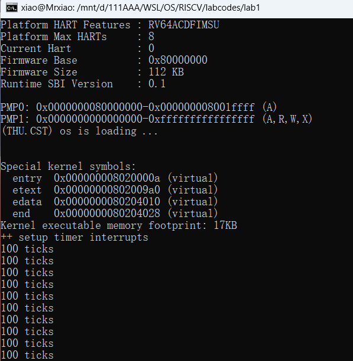
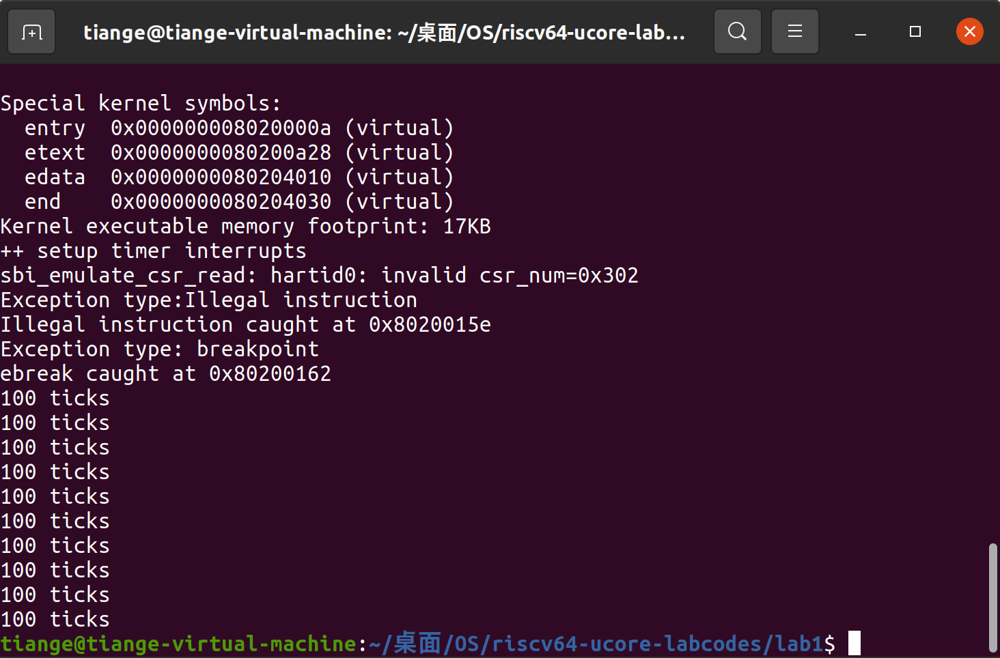

- [实验详情](#实验详情)
- [lab0.5 练习1：使用GDB验证启动流程](#lab05-练习1使用gdb验证启动流程)
  - [1. 调试过程](#1-调试过程)
  - [2. 回答问题](#2-回答问题)
    - [a. 复位代码 (位于物理地址 0x1000)](#a-复位代码-位于物理地址-0x1000)
    - [b. Bootloader代码 (位于物理地址 0x80000000)](#b-bootloader代码-位于物理地址-0x80000000)
    - [c. 跳转到操作系统内核入口 (0x80200000)](#c-跳转到操作系统内核入口-0x80200000)
  - [3. 练习总结](#3-练习总结)
- [lab1 练习1：理解内核启动中的程序入口操作](#lab1-练习1理解内核启动中的程序入口操作)
  - [1. 指令 `la sp, bootstacktop` 解析](#1-指令-la-sp-bootstacktop-解析)
    - [a. 操作：](#a-操作)
    - [b. 目的：](#b-目的)
  - [2. 指令 `tail kern_init` 解析](#2-指令-tail-kern_init-解析)
    - [a. 操作：](#a-操作-1)
    - [b. 目的：](#b-目的-1)
- [lab1 练习2：完善中断处理](#lab1-练习2完善中断处理)
  - [1. 时钟中断实现过程](#1-时钟中断实现过程)
    - [a. 实现思路](#a-实现思路)
    - [b.实现代码](#b实现代码)
    - [c. 代码分析](#c-代码分析)
    - [d. 实验结果](#d-实验结果)
  - [2. 定时器中断中断处理的流程](#2-定时器中断中断处理的流程)
- [lab1 挑战1：描述与理解中断流程](#lab1-挑战1描述与理解中断流程)
  - [1. ucore 中处理中断异常的流程](#1-ucore-中处理中断异常的流程)
    - [a. 异常产生](#a-异常产生)
    - [b. 进入 \_\_alltraps](#b-进入-__alltraps)
    - [c. 保存寄存器](#c-保存寄存器)
    - [d. 传递 a0 参数](#d-传递-a0-参数)
    - [e. 调用 C 语言中断处理函数](#e-调用-c-语言中断处理函数)
    - [f. 处理中断](#f-处理中断)
    - [g. 恢复寄存器](#g-恢复寄存器)
    - [h. 返回到被中断的程序](#h-返回到被中断的程序)
  - [2. mov a0, sp 的目的](#2-mov-a0-sp-的目的)
  - [3. SAVE\_ALL 中寄存器保存在栈中的位置](#3-save_all-中寄存器保存在栈中的位置)
  - [4. 对于任何中断，\_\_alltraps中都需要保存所有寄存器吗？](#4-对于任何中断__alltraps中都需要保存所有寄存器吗)
- [lab1 挑战2：理解上下文切换机制](#lab1-挑战2理解上下文切换机制)
  - [1. `csrw sscratch, sp` 实现的操作和目的](#1-csrw-sscratch-sp-实现的操作和目的)
  - [2. `csrrw s0, sscratch, x0` 实现的操作和目的](#2-csrrw-s0-sscratch-x0-实现的操作和目的)
  - [3. save all里面保存了 `stval`， `scause ` 这些 `csr`，而在restore\_all里面却不还原它们？那这样 store 的意义何在呢？](#3-save-all里面保存了-stval-scause--这些-csr而在restore_all里面却不还原它们那这样-store-的意义何在呢)
- [lab1 挑战3：完善中断异常](#lab1-挑战3完善中断异常)
  - [1. 改写 `exception_handler` 函数](#1-改写-exception_handler-函数)
  - [2. 改写 `clock.c` 文件（触发异常）](#2-改写-clockc-文件触发异常)
- [实验中的重要知识点](#实验中的重要知识点)
  - [1. 启动流程与汇编代码](#1-启动流程与汇编代码)
  - [2. 中断处理](#2-中断处理)
  - [3. 上下文切换](#3-上下文切换)
  - [4. 异常处理](#4-异常处理)
- [操作系统原理中未涉及的知识点](#操作系统原理中未涉及的知识点)
  - [1. 内存管理](#1-内存管理)
  - [2. 进程管理](#2-进程管理)
  - [3. 文件系统](#3-文件系统)
- [RISC-V 中断和异常处理相关寄存器与指令](#RISC-V 中断和异常处理相关寄存器与指令)
  - [1. 寄存器](#1-寄存器)
  - [2. 常用指令](#2-常用指令)
  - [3. `sscratch` 的深入分析](#3-`sscratch` 的深入分析)

<div STYLE="page-break-after: always;"></div>

# 实验详情

* 小组成员：徐亚民，肖胜杰，张天歌
* 实验时间：2024年9月27日
* 指导老师：宫晓利

# lab0.5 练习1：使用GDB验证启动流程

在 lab0 目录下，使用 `make debug` 和 `make gdb` 指令进入调试。使用 gdb 调试 QEMU 模拟的 RISC-V 计算机加电开始运行到执行应用程序的第一条指令（即跳转到0x80200000）这个阶段的执行过程。说明RISC-V硬件加电后的几条指令在哪里？完成了哪些功能？

## 1. 调试过程

* 使用 `x/10i $pc` 指令显示即将执行的10条汇编指令。

```
0x0000000000001000 in ?? ()
(gdb) x/10i $pc
=> 0x1000:      auipc   t0,0x0
   0x1004:      addi    a1,t0,32
   0x1008:      csrr    a0,mhartid
   0x100c:      ld      t0,24(t0)
   0x1010:      jr      t0
   0x1014:      unimp
   0x1016:      unimp
   0x1018:      unimp
   0x101a:      0x8000
   0x101c:      unimp
```

* 使用 `info r t0` 指令显示 t0 寄存器的值。
* 使用 `si` 指令单步执行一条汇编指令。

```
(gdb) info r t0
t0             0x0      0
(gdb) si
0x0000000000001004 in ?? ()
(gdb) info r t0
t0             0x1000   4096
(gdb) si
0x0000000000001008 in ?? ()
(gdb) si
0x000000000000100c in ?? ()
(gdb) si
0x0000000000001010 in ?? ()
(gdb) info r t0
t0             0x80000000       2147483648
(gdb) si
0x0000000080000000 in ?? ()
```

* 使用 `x/10i $pc` 指令显示即将执行的10条汇编指令。

```
0x0000000080000000 in ?? ()
(gdb) x/10i $pc
=> 0x80000000:  csrr    a6,mhartid
   0x80000004:  bgtz    a6,0x80000108
   0x80000008:  auipc   t0,0x0
   0x8000000c:  addi    t0,t0,1032
   0x80000010:  auipc   t1,0x0
   0x80000014:  addi    t1,t1,-16
   0x80000018:  sd      t1,0(t0)
   0x8000001c:  auipc   t0,0x0
   0x80000020:  addi    t0,t0,1020
   0x80000024:  ld      t0,0(t0)
```

* 使用 `break *0x80200000` 指令在 0x80200000 处设置断点。
* 使用 `continue` 指令执行直到碰到断点。

```
(gdb) break *0x80200000
Breakpoint 1 at 0x80200000: file kern/init/entry.S, line 7.
(gdb) continue
Continuing.

Breakpoint 1, kern_entry () at kern/init/entry.S:7
7           la sp, bootstacktop             # 加载 bootstacktop 地址到栈指针（sp）寄存器，初始化栈顶。
```

## 2. 回答问题

RISC-V 硬件加电后的几条指令在以物理地址 0x1000 开头的区域上。之后跳转到以物理地址 0x80000000 开头的区域上，再之后跳转到以物理地址 0x80200000 开头的区域上。

完成的功能如下：

### a. 复位代码 (位于物理地址 0x1000)

* 0x1000: auipc t0,0x0：这是一条立即数偏移指令，它将 PC 的高 20 位与 0 相加，并将结果存储在 t0 寄存器中。由于 PC 当前指向 0x1000，这条指令实际上设置了 t0 为 0x1000。
* 0x1004: addi a1,t0,32：将 t0 (0x1000) 加上 32，结果存储在 a1 寄存器中。这可能是指向一个数据结构或配置表的地址。
* 0x1008: csrr a0,mhartid：从特权模式下的 mhartid 寄存器读取当前硬件线程的 ID 并存储在 a0 寄存器中。mhartid 通常用于多核系统中标识不同的 CPU 核心。
* 0x100c: ld t0,24(t0)：从 t0 + 24 (即 0x1024) 的地址加载一个 64 位的数据到 t0 寄存器中。这个地址可能存储了下一个要执行的代码段的入口地址。
* 0x1010: jr t0：跳转到 t0 寄存器中的地址继续执行。在这个例子中，t0 被设置为 0x80000000，所以控制流跳转到了这个地址。

### b. Bootloader代码 (位于物理地址 0x80000000)

* 0x80000000: csrr a6,mhartid：再次读取当前硬件线程的 ID，这次是为了检查是否是主核心。
* 0x80000004: bgtz a6,0x80000108：如果 a6 (mhartid) 不等于 0，则跳转到 0x80000108。如果不是主核心（mhartid = 0），则跳过一些初始化代码。
* 0x80000008 至 0x80000024：这部分代码准备一些数据结构，例如初始化堆栈指针等。

### c. 跳转到操作系统内核入口 (0x80200000)

* 0x80200000: la sp, bootstacktop：设置栈指针 (sp) 到 bootstacktop，这是初始化堆栈的一个重要步骤。bootstacktop 是预先定义好的一个符号，代表了堆栈的顶端地址。

## 3. 练习总结

* RISC-V 硬件加电后首先执行的是位于 0x1000 的复位代码，该代码负责基本的初始化工作，如读取硬件线程 ID 和加载下一阶段引导代码的地址。
* 然后，通过无条件跳转指令转移到 0x80000000 处的Bootloader代码，这里进行了更详细的初始化，包括多核环境下的核心识别和资源分配。
* 最后，引导过程会跳转到 0x80200000，这是操作系统内核的入口点，在这里设置了正确的堆栈并开始执行主要的程序逻辑。

在QEMU模拟的这款riscv处理器中，将复位向量地址初始化为0x1000，再将PC初始化为该复位地址，因此处理器将从此处开始执行复位代码，复位代码主要是将计算机系统的各个组件（包括处理器、内存、设备等）置于初始状态，并且会启动Bootloader，在这里QEMU的复位代码指定加载Bootloader的位置为0x80000000，Bootloader将加载操作系统内核并启动操作系统的执行。

# lab1 练习1：理解内核启动中的程序入口操作

## 1. 指令 `la sp, bootstacktop` 解析

### a. 操作：

* `la`：表示`“load address”`，即加载地址的指令。它会将一个标签的地址加载到指定的寄存器中。
* `sp`：是栈指针寄存器，负责指向当前栈的顶部。栈用于管理函数调用、局部变量等，栈指针的设置对于程序的运行至关重要。
* `bootstacktop`：是一个标签，代表栈的顶部地址。这个标签的具体地址是在编译时由链接器解析的。
* 执行 `la sp, bootstacktop` 之后，`sp` 寄存器将被设置为 `bootstacktop` 标签所指向的内存地址。

### b. 目的：
分配好内核栈。这意味着：
* 初始化栈：在启动或重置过程的早期阶段，操作系统或引导加载程序会设置栈的起始地址，以便后续的函数调用能够正确地使用栈。
* 内存管理：通过将栈指针指向特定的内存地址，程序可以确保栈在合适的内存区域中分配，从而避免与其他数据或代码的冲突。
  
## 2. 指令 `tail kern_init` 解析

### a. 操作：

* `tail`：这是 `RISC-V` 汇编语言中的一条指令，主要用于实现函数的尾调用优化。它的作用是跳转到指定的函数，而不需要在返回时进行额外的栈操作。也就是说，调用 `tail` 指令时，当前的调用环境将被直接替换为新的调用环境，从而提高效率。
* `kern_init`：这是一个标签，指向一个初始化内核的函数或代码段。它通常包含了系统启动时必须执行的初始化任务，例如设置内存管理、初始化设备驱动程序、设置中断处理等。

### b. 目的：

实现跳转到内核初始化，这条指令将程序的执行流直接转移到 kern_init 函数，开始执行内核的初始化任务。
使用 tail 可以减少栈帧的开销，特别是在函数调用链较深的情况下。通过尾调用，函数的返回地址不会被推入栈中，从而节省了内存和时间。

# lab1 练习2：完善中断处理

## 1. 时钟中断实现过程

### a. 实现思路

* 设置下次时钟中断 `clock_set_next_event()`
* 计数器（`ticks`）加一
* 当计数器加到100的时候，我们会输出一个`100ticks`表示我们触发了100次时钟中断，同时打印次数（`num`）加一
* 判断打印次数，当打印次数为10时，调用`<sbi.h>`中的关机函数关机

### b.实现代码
```python
case IRQ_S_TIMER:
    clock_set_next_event();//发生这次时钟中断的时候，我们要设置下一次时钟中断
    if (++ticks % TICK_NUM == 0) {
        print_ticks();
        num++;
    }
    if(num==10){
        sbi_shutdown();
    }
    break;
```
### c. 代码分析
* `clock_set_next_event()`此函数的作用是设置下一次时钟中断的事件。一般情况下，定时器会在特定的时间间隔内触发中断，处理程序在被调用时需要更新下一个中断的时间设置，以确保系统定期运行时钟中断。这可以帮助系统在合适的时机做出响应，比如调度任务或更新时间。
* `if (++ticks % TICK_NUM == 0)`中`ticks`是一个计数器，每当时钟中断发生时，它会增加 1。这里使用了前缀自增操作符 `++ticks`，意味着在条件判断前先将 `ticks` 增加 1。用于输出。`TICK_NUM` 是一个常量，代表每当 ticks 增加到该数值时执行特定的操作。这个判断的目的是每经过 TICK_NUM 次时钟中断，就会执行以下的代码块。即实现每经过100次时钟终端，输出一次`100 ticks`,并将`num`记录的输出次数加1。
* `if(num==10)`判断当前的输出次数，如果输出次数为10，则调用`<sbi.h>`中的关机函数`sbi_shutdown()`关机。

### d. 实验结果



## 2. 定时器中断中断处理的流程

1. 首先通过`kern_init`入口点运行程序。
2. `kern_init`函数中的`idt_init()`进行初始化中断，在`kern_init`中通过`write_csr(stvec, &__alltraps)`设置`CSG stvec`的值，指向中断处理程序的地址`__alltraps`。
3. `kern_init`函数中的`clock_init()`进行初始化时钟中断，在`clock_init`设置使能时钟中断，并通过`clock_set_next_event()`设置第一次时钟中断事件。
4. 当发生时钟中断时，会通过`CSG stvec`确定到中断入口点`__alltraps`。
5. `__alltraps`通过`SAVE_ALL`和`RESTORE_ALL`实现保存和恢复上下文，并把上下文包装成结构体送到`trap`函数那里去。
6. `trap`函数会调用`trap_dispatch`，通过`CSG scause`判断发生中断的原因，如果`trap`是由中断引起的则调用`interrupt_handler(tf)`，如果`trap`是由异常引起的则调用`exception_handler(tf)`，因为时钟中断属于中断，所以调用`interrupt_handler(tf)`。
7. `interrupt_handler(tf)`中进一步根据`scause`的数值更仔细地分了下类，从而定位到时钟中断，进行相应的处理。

# lab1 挑战1：描述与理解中断流程

## 1. ucore 中处理中断异常的流程

### a. 异常产生

当硬件检测到中断或异常时，CPU 会停止当前指令的执行，并跳转到预定义的异常处理入口地址。在 RISC-V 架构中，这个地址是stvec。

### b. 进入 __alltraps

CPU 跳转到 __alltraps 函数，这是异常处理的入口点。__alltraps 的主要任务是保存当前的 CPU 上下文，以便在处理完中断后能够正确恢复。

### c. 保存寄存器

在 __alltraps 中，首先会保存当前的栈指针（SP）和其他重要的寄存器。这通常通过 SAVE_ALL 宏来实现。

SAVE_ALL 宏会将所有通用寄存器（包括 SP、PC 等）保存到栈中。这样做的目的是确保中断处理程序不会破坏当前程序的执行状态。

### d. 传递 a0 参数

mov a0, sp 的目的是将当前的栈指针（SP）值复制到 a0 寄存器中。a0 寄存器在 RISC-V 汇编中通常用作函数调用的第一个参数。通过将 SP 值传递给 a0，可以在后续的 C 语言中断处理函数中访问保存的寄存器上下文。

### e. 调用 C 语言中断处理函数

__alltraps 会调用一个 C 语言编写的中断处理函数， traps_c。这个函数会根据中断类型调用相应的处理程序。

### f. 处理中断

中断处理程序执行具体的中断处理逻辑，例如处理定时器中断、外部设备中断等。

### g. 恢复寄存器

中断处理完成后，__alltraps 会恢复之前保存的所有寄存器。这通常通过 RESTORE_ALL 宏来实现。

### h. 返回到被中断的程序

最后，__alltraps 会从异常处理返回，恢复程序的正常执行。

## 2. mov a0, sp 的目的

mov a0, sp 的目的是将当前的栈指针（SP）值复制到 a0 寄存器中。这样做是为了在 C 语言中断处理函数中能够访问保存的寄存器上下文。a0 寄存器在 RISC-V 汇编中通常用作函数调用的第一个参数，因此通过 a0 可以将栈指针传递给 C 语言函数，使得 C 语言函数能够访问保存的寄存器值。

## 3. SAVE_ALL 中寄存器保存在栈中的位置

SAVE_ALL 汇编宏会将所有通用寄存器保存到栈中。寄存器保存在栈中的位置是由汇编宏定义确定的。

## 4. 对于任何中断，__alltraps中都需要保存所有寄存器吗？

我们定义一个汇编宏 SAVE_ALL, 用来保存所有寄存器到栈顶（实际上把一个trapFrame结构体放到了栈顶）。然后在__alltraps中会调用汇编宏 SAVE_ALL，因此对于任何中断，__alltraps中都需要保存所有寄存器。

# lab1 挑战2：理解上下文切换机制

> 在`trapentry.S`中汇编代码 `csrw sscratch, sp`；`csrrw s0, sscratch, x0`实现了什么操作，目的是什么？save all里面保存了`stval`，`scause `这些 `csr`，而在restore_all里面却不还原它们？那这样 store 的意义何在呢？

## 1. `csrw sscratch, sp` 实现的操作和目的

`csrw`指令用于在RISC-V架构中对控制和状态寄存器进行写入操作。==指令`csrw sscratch, sp`将当前堆栈指针`sp`的值存储到`sscratch`寄存器中。==

`sscratch`寄存器通常被用作临时寄存器，**其主要目的是在中断发生时，为了保存内核的堆栈指针而创建的一个临时存储空间。**

## 2. `csrrw s0, sscratch, x0` 实现的操作和目的

**`csrrw`** (Control and Status Register Read and Write) 是一个特权指令，用于从控制状态寄存器中读取值并写入另一个寄存器。

- **`s0`**是目标寄存器，指令执行后，`s0` 中将存储 `sscratch` 寄存器的当前值。
- **`sscratch`**是一个控制状态寄存器，通常用于保存特权模式下的上下文信息。具体作用取决于硬件实现，通常用于保存临时数据。
- **`x0`**是零寄存器，取值为 0 。
- **操作为：**将 `sscratch` 的值赋给保存寄存器 `s0`，再把零寄存器 `x0` 的值赋给 `sscratch` ，此时`sscratch` 中的值为零（被还原）。
- **目的为：**将 `sscratch` ==最初临时保存的 `sp` 栈指针寄存器==的值储存给 s0
- 想要保存 `sscratch` 到内存中，**但因为 CSR 不能直接写入内存，所以要借助通用寄存器 `s0`，然后将 `sscratch`的值恢复为0。**

## 3. save all里面保存了 `stval`， `scause ` 这些 `csr`，而在restore_all里面却不还原它们？那这样 store 的意义何在呢？

`stval` 中记录的是记录一些中断处理所需要的辅助信息，比如发生中断或异常的目标地址或者出错的指令；而 `scauses` 记录中断发生的原因，以及该中断是不是一个外部中断。

这两个寄存器存储的信息都会给OS的中断处理**提供宝贵的信息**，因此必须进行 `save` ，但在操作系统处理完毕之后，这些信息就变得无用，不需要再恢复进行 `restore`。

# lab1 挑战3：完善中断异常

> 编程完善在触发一条非法指令异常 `mret` 和，在 `kern/trap/trap.c`的异常处理函数中捕获，并对其进行处理，简单输出异常类型和异常指令触发地址，即“`Illegal instruction caught at 0x`(地址)”，“`ebreak caught at 0x`（地址）”与“`Exception type:Illegal instruction`"，“`Exception type: breakpoint`”。

## 1. 改写 `exception_handler` 函数

```c
void exception_handler(struct trapframe *tf) {
    switch (tf->cause) {
        case CAUSE_MISALIGNED_FETCH:
            break;
        case CAUSE_FAULT_FETCH:
            break;
        case CAUSE_ILLEGAL_INSTRUCTION:
            /* LAB1 CHALLLENGE3   YOUR CODE 2211123 */
            // 非法指令异常处理
            /*(1)输出指令异常类型（ Illegal instruction）
             *(2)输出异常指令地址
             *(3)更新 tf->epc寄存器
            */
            cprintf("Exception type:Illegal instruction\n");
            cprintf("Illegal instruction caught at 0x%08x\n", tf->epc);
            tf->epc+=4;
            break;
         case CAUSE_BREAKPOINT:
            //断点异常处理
            /* LAB1 CHALLLENGE3   YOUR CODE 2211123 */
            /*(1)输出指令异常类型（ breakpoint）
             *(2)输出异常指令地址
             *(3)更新 tf->epc寄存器
            */
            cprintf("Exception type: breakpoint\n");
            cprintf("ebreak caught at 0x%08x\n", tf->epc);
            tf->epc+=2;     //断点异常指令占两个字节  
            break;
          // other interruptions
       }
   }    
```

## 2. 改写 `clock.c` 文件（触发异常）

```C
void clock_init(void) {
    // enable timer interrupt in sie
    set_csr(sie, MIP_STIP);
    // divided by 500 when using Spike(2MHz)
    // divided by 100 when using QEMU(10MHz)
    // timebase = sbi_timebase() / 500;
    clock_set_next_event();

    // initialize time counter 'ticks' to zero
    ticks = 0;
    cprintf("++ setup timer interrupts\n");
    
    __asm__ __volatile__("mret"); // 触发非法伪指命异常
    __asm__ __volatile__("ebreak"); // 触发断点异常
}
```

`make qemu` 查看输出，可以看到异常中断完善成功：



# 实验中的重要知识点

## 1. 启动流程与汇编代码

* 知识点：理解RISC-V硬件加电后的指令执行和系统启动的过程。
* 原理关联：系统启动（booting）是计算机从关机状态到完全加载操作系统的过程。在这个过程中，固件（如BIOS或UEFI）负责初始化硬件和加载引导程序。通过调试可以看到在加电后系统执行的初始化指令，例如设置栈指针和跳转到程序入口。
* 含义与关系：启动流程为操作系统的正常运行打下基础，理解汇编代码中的指令能帮助我们掌握底层硬件与软件的交互。

## 2. 中断处理

* 知识点：理解中断的概念和处理流程，特别是时钟中断的处理。
* 原理关联：中断处理是操作系统管理外部事件的重要机制。当外部设备请求服务时，CPU会暂时停止当前执行的任务，转而处理中断请求。定时器中断是最常见的类型之一，用于实现时间片轮转和任务调度。
* 含义与关系：中断处理允许操作系统高效地响应外部事件，并保证系统的实时性。实现每100次时钟中断调用特定函数的任务帮助我们理解如何利用中断来实现功能。

## 3. 上下文切换

* 知识点：了解上下文切换的机制和实现，尤其是在处理器状态保存和恢复的过程。
* 原理关联：上下文切换是操作系统在多任务处理中的核心功能，涉及到保存当前任务的状态和加载下一个任务的状态。有效的上下文切换可以提高系统性能和响应速度。
* 含义与关系：理解上下文切换的过程可以帮助我们更好地设计和优化操作系统的调度算法。

## 4. 异常处理

* 知识点：捕获和处理异常的机制，特别是非法指令和断点的处理。
* 原理关联：异常是程序执行过程中发生的特殊事件，操作系统需要提供机制来处理这些异常。通过汇编指令的处理，可以实现对异常的捕获和反馈。
* 含义与关系：异常处理保证了系统的健壮性与安全性，理解异常的处理有助于程序的调试和错误管理。

# 操作系统原理中未涉及的知识点

## 1. 内存管理

在实验中未深入探讨内存管理机制（如页表管理、虚拟内存等）。然而，这对于操作系统性能和资源利用至关重要。

## 2. 进程管理

虽然实验涉及到上下文切换，但未讨论更复杂的进程管理机制，如进程调度策略和进程状态管理。

## 3. 文件系统

实验中未提及文件系统的实现和管理，而文件系统是操作系统中至关重要的组成部分，负责数据的持久化存储。


# RISC-V 中断和异常处理相关寄存器与指令

## 1. 寄存器

### `sstatus`（Supervisor Status Register）

- **SIE (Supervisor Interrupt Enable)**: 设置为 0 时，禁止 Supervisor 模式的中断。

### `stvec`（Supervisor Trap Vector Register）

- 存储中断向量表的基地址，并且最低两个二进制位用来编码中断处理模式。
  - **`00`**: 存储唯一的中断处理程序的地址。
  - **`01`**: 存储中断向量表的基址。

### `sepc`（Supervisor Exception Program Counter）

- 记录触发中断的那条指令的地址。

### `scause`

- 记录中断发生的原因，包括中断类型（外部中断或其他）。

### `stval`

- 存储与中断处理相关的辅助信息，如目标地址或出错指令，帮助识别出错的具体情况。

## 2. 常用指令

### `ecall`（Environment Call）

- 用于在 S 状态或 U 状态下发起系统调用，触发异常，从 S 模式切换到 M 模式，或从 U 模式切换到 M 模式。

### `sret`（Supervisor Return）

- 从 S 状态中断返回到 U 状态，实际执行为 `pc ← sepc`，即将程序计数器设置为触发中断的指令地址。

### `ebreak`（Environment Break）

- 触发中断处理流程，常用于调试。

### `mret`（Machine Return）

- 从 M 状态中断返回到 S 状态或 U 状态，实际执行为 `pc ← mepc`。

## 3. `sscratch` 的深入分析

### `sscratch`

- Supervisor Scratch Register，作为一个临时寄存器，用于在中断处理过程中保存和交换栈指针。

### 功能与作用

- 当中断发生时，操作系统需要进入内核态，并确保 32 个基本寄存器的值保持不变。此时，`sscratch` 用于保存与当前栈指针（`sp`）相关的地址信息。

### 用户态与内核态的切换

- **用户态中断**: `sscratch` 存储内核态栈的地址；在处理中断时需要首先交换 `sp` 和 `sscratch`。
- **内核态中断**: `sscratch` 通常初始化为 0，直接从 `sscratch` 中恢复 `sp`，实现内核栈的有效使用。

### 实现流程

1. **中断处理开始**:
   - 检查当前模式（用户态或内核态）。
   - 根据 `sp` 和 `sscratch` 的值判断是否需要切换到内核栈。

2. **栈指针交换**:
   - 如果是用户态中断，`sp` 被切换到内核栈；若是内核态中断，则从 `sscratch` 读取回原来的 `sp`。

3. **最终状态**:
   - `sp` 指向内核栈，而 `sscratch` 指向中断发生前的栈，便于后续恢复。

